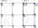

CellMLAdapter
==============

A CellMLAdapter class is used to run a CellML model. It contains a code generator that produces efficient code for the given model at compile time.

The given CellML model is always computed for all nodes of a mesh, i.e. there are multiple instances being computed.
By specifying a mesh with 0 elements, you get a single instance of the model.

A CellML model is a first-order differential-algebraic system of equations (DAE) of the following form:

.. math::
   \frac{\partial \textbf{u}}{\partial t} = f(t,\textbf{u}(t),\textbf{y}(t),\hat{\textbf{c}},\hat{\textbf{p}}(t)) \\
   \textbf{y}(t) = g(\textbf{u}(t),\hat{\textbf{c}},\hat{\textbf{p}}(t))
   
The values :math:`\textbf{u} \in \mathbb{R}^n` are called *states* and will be integrated in time using a timestepping scheme. 
There are also the intermediate values, :math:`\textbf{y}`, which are not integrated. 
A set of parameters, :math:`\hat{\textbf{p}}`, can be defined in the settings and changed over time.
There are also constants , :math:`\hat{\textbf{c}}`, that are given in the CellML model and cannot be changed.

There exist several different names for the quantities :math:`\textbf{u}, \frac{\partial \textbf{u}}{\partial t}, \textbf{y}` and :math:`\hat{\textbf{p}}`:

=============================================== ================ =========== ==========
symbol                                          opendihu         OpenCOR     OpenCMISS 
=============================================== ================ =========== ==========
:math:`\textbf{u}`                              states           states      STATES
:math:`\frac{\partial \textbf{u}}{\partial t}`  rates            rates       RATES
:math:`\textbf{y}`                              intermediates    algebraic   WANTED  
:math:`\hat{\textbf{p}}`                        parameters       algebraic   KNOWN
:math:`\hat{\textbf{c}}`                        constants        constants   CONSTANTS
=============================================== ================ =========== ==========
 
Initially the CellML model does not have any 'parameters', all values are given some defined value. 
In opendihu, any *constants* and *intermediates* can be transformed into *parameters* and then have changing values assigned.
This is done by the options ``parametersUsedAsIntermediate`` and ``parametersUsedAsConstant``.

Usage
----------
The following C++ code shows the typical usage inside a time stepping scheme to solve the model:

.. code-block:: c

  TimeSteppingScheme::ExplicitEuler<
    CellmlAdapter<57,1>  // nStates,nIntermediates: 57,71 = Shorten, 4,9 = Hodgkin Huxley
  >

The two template arguments of `CellmlAdapter` are the *number of states* and the *number of intermediates*.
This has to match the actual numbers of the CellML model that is to be computed. Consequently, when a specific model should be computed, the CellmlAdapter has be adjusted.

If the numbers are not correct a corresponding error will be shown from which the correct numbers can be learned.

.. code-block:: python

  "CellML": {
    "modelFilename":                          "../../input/hodgkin_huxley_1952.c",    # Cellml file or C++ source file
    #"libraryFilename":                       "cellml_simd_lib.so",                   # (optional) filename of a compiled library, overrides modelFilename
    "optimizationType":                       "simd",                                 # "vc", "simd", "openmp" type of generated optimizated source file
    "compilerFlags":                          "-fPIC -O3 -shared ",                   # additional compiler flags for the compilation of the model source file
    #"statesInitialValues":                   [],                                     # (optional) initial values of all states, if not set, values from CellML model are used
    #"setSpecificParametersFunction":         set_specific_parameters,                # callback function that sets parameters like stimulation current
    #"setSpecificParametersCallInterval":     int(1./stimulation_frequency/dt_0D),    # set_specific_parameters should be called every 1/stimulation_frequency seconds
    "setSpecificStatesFunction":              set_specific_states,                    # callback function that sets states like Vm, activation can be implemented by using this method and directly setting Vm values, or by using setParameters/setSpecificParameters
    #"setSpecificStatesCallInterval":         2*int(1./stimulation_frequency/dt_0D),  # set_specific_states should be called stimulation_frequency times per ms, the factor 2 is needed because every Heun step includes two calls to rhs
    "setSpecificStatesCallInterval":          0,                                      # call intervall of the set_specific_states function, 0 means use setSpecificStatesCallFrequency instead
    "setSpecificStatesCallFrequency":         get_specific_states_call_frequency,     # set_specific_states should be called stimulation_frequency times per ms
    "setSpecificStatesFrequencyJitter":       get_specific_states_frequency_jitter,   # list of values to add or substract to setSpecificStatesCallFrequency every stimulation, this is to add random jitter to the frequency
    "setSpecificStatesRepeatAfterFirstCall":  0.01,                                   # [ms] simulation time span for which the setSpecificStates callback will be called after a call was triggered
    "setSpecificStatesCallEnableBegin":       get_specific_states_call_enable_begin,  # [ms] first time when to call setSpecificStates
    "additionalArgument":                     fiber_no,                               # any additional value that will be given to the callback functions
    "intermediatesForTransfer":               [],                                     # which intermediate values to use in further computation
    "statesForTransfer":                      [0],                                    # which state values to use in further computation, Shorten / Hodgkin Huxley: state 0 = Vm
    
    "parametersUsedAsIntermediate":           [32],                                   # list of intermediate value indices, that will be set by parameters. Explicitely defined parameters that will be copied to intermediates, this vector contains the indices of the algebraic array. This is ignored if the input is generated from OpenCMISS generated c code.
    "parametersUsedAsConstant":               [65],                                   # list of constant value indices, that will be set by parameters. This is ignored if the input is generated from OpenCMISS generated c code.
    "parametersInitialValues":                [0.0, 1.0],                             # initial values for the parameters, e.g. I_Stim, l_hs
    "meshName":                               "MeshFiber_{}".format(fiber_no),
    "stimulationLogFilename":                 "out/stimulation.log",
  },      
  
In the following all parameters are explained.

modelFilename
---------------

This is the CellML model file. It can either be the XML file or a C code file. If it is an XML file, *opendihu* will use *OpenCOR* to convert it a c code file first. 
Afterwards, optimized C code is generated and stored in another file in the 'src' directory. The code is compiled to a shared library (extension ’\*.so’) that gets loaded at runtime.

libraryFilename
---------------

Optional, if given it should be a shared object library (*.so) that contains the model.
This will be used instead of the model given in *modelFilename*.

statesInitialValues
---------------------
Optional, if given it should contain a list of initial values for all states. 
If there are multiple instances (multiple nodes of a mesh where the model is computed), the list can either contain separate values for all states for all instances. Then it takes the form `[instance0state0, instance0state1, ..., instance0stateN, instance1state0, instance1state1, ..., instance1stateN, ...]`

Or you only specify each state once, then all instances will be initialized by the same values.

If *statesInitialValues* is not specified, the initial values will be parsed from the model. Usually this is what is needed.

Callbacks
-------------

A CellMLAdapter can have several callback functions. These are python functions that will be called in regular time intervals during the computation and can alter values of the computation.
They can be used, e.g., to stimulate a subcellular model at specific times.

The different callback functions and their time step interval by which the functions will be called are listed below. 
All of them will get the value of the option *additionalArgument* as its last argument. Like this it is possible to distinguish different instances in the functions when *CellMLAdapter* is nested inside *MultipleInstances*. This is the case for multiple fibers, where the *additionalArgument* can be the fiber number.

*setParametersFunction* and *setParametersCallInterval*
^^^^^^^^^^^^^^^^^^^^^^^^^^^^^^^^^^^^^^^^^^^^^^^^^^^^^^^^^^^
Callback function and time step interval by which the function will be called.
This function can change all parameters and has the following signature:

.. code-block:: python

  def set_parameters(n_dofs_global, timestep_no, current_time, parameters, dof_nos_global_natural, additional_argument):
    # n_dofs_global: (int) global number of dofs in the mesh, i.e. number of CellML instances to be computed
    # timestep_no:   (int) current time step number, advances by the value of "setParametersCallInterval"
    # current_time:  (float) the current simulation time
    # parameters:    list of floats: [instance0p0, instance0p1, ... instance0pN, instance1p0, instance1p1, ...]
    #                The nParameters*nInstances parameter values (KNOWN values) to all instances, this list can be altered inside
    #                this function and will take effect in the CellML model
    # dof_nos_global_natural: list of ints: [dofNo0, dofNo1, ...] 
    #                For the local dofs the gobal numbers in global natural ordering. This are all dofs on this rank for 
    #                which the parameters are given. See the example below.
    # additional_argument: The value of the option "additionalArgument", can be any Python object.

.. _callbackmesh:

  
  Example mesh with two subdomains and global natural ordering of the nodes.

For example, consider a mesh as in :numref:`callbackmesh` where a CellML model is computed on each node. The mesh is partitioned to two subdomains.
Rank 0 computes the grey nodes, rank 1 computes the blue nodes. The global natural ordering is given in the figure.

Then, on rank 0, ``dof_nos_global_natural`` will contain the list ``[0,1,4,5,8,9]`` and on rank 1, the list will be  ``[2,3,6,7,10,11]``. 
This shows to which global nodes the values in the `parameters` list correspond. With this information, the callback function could decide which parameters to update.

This callback function is slower than `setSpecificParametersFunction`.

*setSpecificParametersFunction* and *setSpecificParametersCallInterval*
^^^^^^^^^^^^^^^^^^^^^^^^^^^^^^^^^^^^^^^^^^^^^^^^^^^^^^^^^^^^^^^^^^^^^^^^^^^^
Callback function and time step interval by which the function will be called.
This function can change some parameters and has the following signature:

.. code-block:: python

  def set_specific_parameters(n_dofs_global, timestep_no, current_time, global_parameters, additional_argument):
    # n_dofs_global:  (int) global number of dofs in the mesh, i.e. number of CellML instances to be computed
    # timestep_no:    (int)   current time step number, advances by the value of "setSpecificParametersCallInterval"
    # current_time:   (float) the current simulation time
    # global_parameters:  (dict)  initially an empty dict, the parameters to be changed should be indicated in this dict (see below)
    # additional_argument: The value of the option "additionalArgument", can be any Python object.
  
    # set parameters using calls like the following
    
    global_parameters{([x,y,z], nodal_dof_index, parameter_no)} = value
    # [x,y,z] are the global coordinates of the node to set the parameter
    # nodal_dof_index is the dof number of the node, usually 0. Only for Hermite ansatz functions it can be higher.
    # parameter_no is the parameter number to set 
    # value is the new parameter value

*setSpecificStatesFunction* and *setSpecificStatesCallInterval*
^^^^^^^^^^^^^^^^^^^^^^^^^^^^^^^^^^^^^^^^^^^^^^^^^^^^^^^^^^^^^^^^^^^^^
Callback function and time step interval by which the function will be called.
This function can change some states and has the following signature:

.. code-block:: python

  def set_specific_states(n_dofs_global, timestep_no, current_time, global_states, additional_argument):
    # n_dofs_global:  (int) global number of dofs in the mesh, i.e. number of CellML instances to be computed
    # timestep_no:    (int)   current time step number, advances by the value of "setSpecificParametersCallInterval"
    # current_time:   (float) the current simulation time
    # global_states:  (dict)  initially an empty dict, the states to be changed should be indicated in this dict (see below)
    # additional_argument: The value of the option "additionalArgument", can be any Python object.
  
    # set states using calls like the following
    
    global_states{([x,y,z], nodal_dof_index, state_no)} = value
    # [x,y,z] are the global coordinates of the node for which to set the state
    # nodal_dof_index is the dof number of the node, usually 0. Only for Hermite ansatz functions it can be higher.
    # state_no is the state number to set 
    # value is the new state value
    
*setSpecificStatesCallEnableBegin*, *setSpecificStatesCallFrequency* and *setSpecificStatesFrequencyJitter*
^^^^^^^^^^^^^^^^^^^^^^^^^^^^^^^^^^^^^^^^^^^^^^^^^^^^^^^^^^^^^^^^^^^^^^^^^^^^^^^^^^^^^^^^^^^^^^^^^^^^^^^^^^^^^^^^^
If *setSpecificStatesCallInterval* is set to 0, the times when to call *setSpecificStatesFunction* are given by *setSpecificStatesCallEnableBegin*, *setSpecificStatesCallFrequency* and *setSpecificStatesFrequencyJitter*.

With these options, it is possible to efficiently specify a repeating pattern of calling the callback function. This is the recommended way to model a frequency encoded stimulation.

The first call of the callback is at simulation time *setSpecificStatesCallEnableBegin*. Using this parameter, a "ramp" can be modelled.
The callback is then called according to the frequency in *setSpecificStatesCallFrequency*. The frequency is :math:`1/T` and thus does not count timesteps, as with *setSpecificStatesCallInterval*, but uses the simulation time directly.

The frequency is modulated by applying a relative jitter, given in a list by *setSpecificStatesFrequencyJitter*. The jitter values are taken from the list and repeated. A value of 0 indicates no jitter, i.e. the frequency is met exactly. E.g., a value of 1.1 means a 10% longer time between subsequent calls to the function.

After the callback was called it will be repeated in the next timesteps *setSpecificStatesRepeatAfterFirstCall* times. Using this setting, a "square" signal can be modelled.
    
*handleResultFunction* and *handleResultCallInterval*
^^^^^^^^^^^^^^^^^^^^^^^^^^^^^^^^^^^^^^^^^^^^^^^^^^^^^^^^^^^
Callback function and time step interval by which the function will be called.
This function can be used to postprocess the result and has the following signature:

.. code-block:: python

  def handle_result(n_instances, timestep_no, current_time, global_states, additional_argument):
    # n_instances:         (int) global number of CellML instances to be computed
    # timestep_no:         (int)   current time step number, advances by the value of "setSpecificParametersCallInterval"
    # current_time:        (float) the current simulation time
    # states_list:         (list of floats) all state values in struct-of-array memory layout,
    #                       i.e. [instance0state0, instance1state0, ... instanceNstate0, instance0state1, instance1state1, ...]
    # intermediates_list:  (list of floats) all intermediate values in struct-of-array memory layout, 
    #                       i.e. [instance0intermediate0, instance1intermediate0, ... instanceNintermediate0, instance0intermediate1, instance1intermediate1, ...]
    # additional_argument: The value of the option "additionalArgument", can be any Python object.

parametersUsedAsIntermediate
------------------------------------------------
(list of int) List of intermediate numbers that will be replaced by parameters.
There are explicitely defined parameter values that will be copied to these intermediates. 
This vector contains the indices of the algebraic array. 

parametersUsedAsConstant
------------------------------------------------
(list of int) List of indices, which constants in the computation will be replaced by parameters.

parametersInitialValues
---------------------------------
(list of float) List of values of the parameters. This also defines the number of parameters.

Example:
.. code-block:: python

  parametersInitialValues = [1.0, 2.0, 3.0]
  parametersUsedAsIntermediate = [5, 2]
  parametersUsedAsConstant[10]
  
This example will compute the given CellML model with the following modifications: The intermediate/algebraic values ``intermediates[5]`` and ``intermediates[2]`` will not be computed by the model, but get the values ``1.0`` and ``2.0``. These values may be changed later using one of the callback functions.
The variable ``constants[10]`` will be set to ``3.0`` and not changed.
  
meshName
------------------------------------------------
The mesh to use, to be defined under "Meshes". For details, see :ref:`define_meshes`. You can instead also just specify ``nElements`` to directly set the number of instances to be computed.

stimulationLogFilename
------------------------------------------------
Default: "out/stimulation.log"

A file name of an output file that will contain all firing times.

*intermediatesForTransfer* and *statesForTransfer*
------------------------------------------------------
(list of ints) Which intermediates and states should be transferred to the other solver in either a `Coupling`, `GodunovSplitting` or `StrangSplitting`.

The total number of field variables to be transferred is the sum of the length of these two settings.

optimizationType
--------------------
Possible values: ``simd``, ``vc``, ``openmp``. Which type of code to generate. ``openmp`` produces code for shared-memory parallelization, using OpenMP. ``simd`` produces auto-vectorizable code. ``vc`` produces explicitly vectorized code (fastest).

compilerFlags
-----------------
Additional compiler flags for the compilation of the source file. Default: ``-fPIC -finstrument-functions -ftree-vectorize -fopt-info-vec-optimized=vectorizer_optimized.log -shared``

When compiled in release target, ``-O3`` is added. In debug target, ``-O0 -ggdb`` is added. If *optimizationType* is ``openmp``, ``-fopenmp`` is added.

