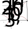
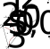
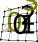

MappingsBetweenMeshes
======================

When multiple meshes are involved, data has to be transferred between meshes. 
A mapping between two different meshes is a special case in the normal data transfer in the Operator Splitting and Coupling schemes. 
If the meshes do not match, a mapping between these meshes is retrieved from the `MappingBetweenMeshes::Manager` class.
Every mesh is identified by its ``meshName``. A mapping between two meshes is identified by the two mesh names of the involved meshes.

The actual mapping object stores information, how to map values from a field variables of the source mesh to values of a field variable of the target mesh.
The initialization of these connectivity data can be expensive. Therefore, it is important to properly initialize the mappings.

At the beginning of the settings, multiple mappings between meshes can be initialized with given options. Then the mappings will be generated at the beginning of the program. 
Use the key "MappingsBetweenMeshes" as shown below. If the required meshes are not initialized like this, they will be created on-the-fly the first time they are needed.

In certain cases there are two possibilities how to map between two meshes (if the dimension of the meshes is equal). Then, if mapping from mesh A to B is required, either the mapping A->B is used or the inverse mapping of B->A is used. 
If one of them was initialized and the other was not, then the initialized version will be used. If none of them was initialized, A->B will be used. But this choice could not be the optimal. Therefore, it is recommended to initialize all used mappings.

Python Settings
---------------

The following is an example how to initialize mappings between meshes:

.. code-block:: python

  config = {
    "mappingsBetweenMeshesLogFile":   "mappings_between_meshes_log.txt",    # log file for mappings 
    "Meshes":  ... # define all meshes here
    
    "MappingsBetweenMeshes": {
      "meshA": "meshB",
      "meshC": {"name": "meshD", "xiTolerance": 0.01, "enableWarnings": True, "compositeUseOnlyInitializedMappings": True, "defaultValue": 0.0},
      
      # the following is from the multidomain_contraction example
      "3Dmesh": [
         {"name": "3Dmesh_elasticity_quadratic",                                "xiTolerance": 0.01, "enableWarnings": True, "compositeUseOnlyInitializedMappings": True},
         {"name": "3Dmesh_elasticity_quadratic+3DFatMesh_elasticity_quadratic", "xiTolerance": 0.01, "enableWarnings": True, "compositeUseOnlyInitializedMappings": True},     # mapping from multidomain to elasticity mesh, for transferring γ
      ],
      "3DFatMesh":  [
         {"name": "3DFatMesh_elasticity_quadratic",                             "xiTolerance": 0.01, "enableWarnings": True, "compositeUseOnlyInitializedMappings": True},
         {"name": "3Dmesh_elasticity_quadratic+3DFatMesh_elasticity_quadratic", "xiTolerance": 0.01, "enableWarnings": True, "compositeUseOnlyInitializedMappings": True},     # mapping from multidomain to elasticity mesh, for transferring γ
      ],
      "3Dmesh_elasticity_quadratic+3DFatMesh_elasticity_quadratic": [
         {"name": "3Dmesh",    "xiTolerance": 0.01, "enableWarnings": False, "compositeUseOnlyInitializedMappings": True},    # mapping uses mappings of submeshes (i.e. 3Dmesh_elasticity_quadratic->3Dmesh)
         {"name": "3DFatMesh", "xiTolerance": 0.01, "enableWarnings": False, "compositeUseOnlyInitializedMappings": True},    # mapping uses mappings of submeshes (i.e. 3DFatMesh_elasticity_quadratic->3DFatMesh)    
      ],
    },
    
The mapping from ``meshA`` to ``meshB`` can be initialized by inserting ``"meshA": "meshB"`` in the dict under ``"MappingsBetweenMeshes"``, as shown above. This does not initialize the reverse mapping ``meshB`` to ``meshA``.
This brief method is to initialize mappings using default values for all settings.

If the options should be specified, the second possibility can be used, where the value of the ``key:value`` pair is itself a dict. This can be seen with mesh ``"meshC"`` above. The name of the target mesh has to be given under the key ``"name"``.
The further options are explained below.

If there should be multiple mappings from a single mesh, then a list has to be used, because one key cannot appear multiple times in a dict. In the above example, this was done for the mesh ``3Dmesh``, which maps to ``3Dmesh_elasticity_quadratic`` and ``3Dmesh_elasticity_quadratic+3DFatMesh_elasticity_quadratic`` (this is a composite mesh).

mappingsBetweenMeshesLogFile
^^^^^^^^^^^^^^^^^^^^^^^^^^^^^^^
This is the name of a log file that will contain events during creation and mapping.

The following options are valid for the target mesh dict.

name
^^^^^
The name of the target mesh.

xiTolerance
^^^^^^^^^^^^^^
(default: 0.1, this was tested to be reasonable)

The element coordinates are called xi, e.g. for a 3D element :math:`\xi_1, \xi_2, \xi_3 \in [0,1]^3`. The tolerance specifies when a point is considered and checked if it is still inside the element, even if it has a :math:`\xi` value <0 or >1. 

A point is also inside the element for (:math:`xi` < 0 but :math:`xi` > -xiTolerance) or, analogously, (:math:`xi` > 1 but :math:`xi` < 1+xiTolerance), if the respective element is the best fit among all elements.
This means, if the point is outside of the actual mesh, then it is treated (in the construction of the mapping between meshes) as if it were inside the nearest element.
Thus, with this tolerance, also nodes of the source mesh that are slightly outside the target mesh get a value mapped. This is useful for fiber mesh that lie exactly on the outer boundary of the 3D muscle mesh.

This tolerance only applies to the decision if the point is considered inside the element, not to the actual computation of the xi coordinates of the point inside the element.
Inside the mesh (not at the boundary) multiple adjacent elements may claim ownership of a point because of that tolerance. Then they will be all considered and the actual xi coordinates for the point will be computed from which the element where the point is really inside will be detected.
This means the tolerance has no effect on the error of the mapping.

enableWarnings
^^^^^^^^^^^^^^^^^
(default: True)

Show some warnings if not all target mesh nodes get values mapped to. Set this to false to have not so many warnings in the output. It definitely makes sense if 
``"compositeUseOnlyInitializedMappings": True``, because then this case happens on purpose.

compositeUseOnlyInitializedMappings
^^^^^^^^^^^^^^^^^^^^^^^^^^^^^^^^^^^^^^^^^^^
(default: False)

For mappings from a composite mesh to any mesh (composite or not), only reuse all mappings from the sub meshes to the target mesh to construct the mapping. These sub mappings have to be initialized.

For example, if there is a mapping ``"meshA+meshB" -> "meshC"``, then if the option is ``compositeUseOnlyInitializedMappings: False`` (as the default), it will create the normal mapping, iterating over all points in the composite mesh "meshA+meshB" and finding the containing element in "meshC".
If the option is True, it will consider the mappings ``"meshA" -> "meshC"`` and ``meshB" -> "meshC"``, each only if it was initialized. It will reuse the information from these mappings and the mapping data should be the same as when the option is False.
However, with this it is possible to construct a mapping where the the target mesh is only on a part of the composite mesh.

Consider the following use case: In the examples where we consider a fat layer (e.g. multidomain_contraction), we have a muscle mesh ``"3Dmesh"`` and a fat layer mesh ``3DFatMesh`` that are adjacent. 
There is a composite mesh ``"3Dmesh+3DFatMesh"``.
The extra-cellular potential :math:`phi_e` in the muscle domain on mesh ``3Dmesh`` should be mapped to the composite mesh ``3Dmesh+3DFatMesh``. Normally the setup of the mapping ``3Dmesh -> 3Dmesh+3DFatMesh`` would be inefficient, 
because the ``3DFatMesh`` part of the composite mesh get no values mapped but during the setup the mapping class searches for parts of the other mesh there. Instead, we can use this option and initialize the mappings ``3Dmesh -> 3Dmesh`` and ``3DFatMesh->3DFatMesh`` or similar when the single meshes are not identical (as is the case in multidomain_contraction where the elasticity mesh is coarser).

defaultValue
^^^^^^^^^^^^^^^^^
(default: 0.0)

When mapping from a lower dimensional to a higher dimensional mesh, e.g. from a 1D fiber mesh to a 3D muscle volume, there can be some degrees of freedom in the higher dimensional mesh that have no nearby degrees of freedom of the lower dimensional mesh.
E.g., there might be regions of the 3D muscle volume where there is no fiber nearby. By default, these dofs will get the value 0.0 when mapping from the 1D to the 3D mesh.

This default value can be changed by this option. A use case is where the transmembrane potential :math:`V_m` is mapped from fibers to the muscle. Then set `defaultValue` to the equilibrium value, to have this value set where no fiber is.
An example that uses this option is ``examples/electrophysiology/fibers/analytical_fibers_emg``.

Mapping 
-----------
In the following the actual data mapping will be explained.

We always map values from a set of points to a target mesh, i.e. there is no structural information like mesh connectivity associated with the source data. Therefore it is not relevant if the source mesh is 1D,2D or 3D as only points in 3D space will be considered. 
This helps in the partitioning, it is only required, that the source points are on the same partition as the target element that surrounds it. (if the elements of the source mesh would also be considered then there would be problems with the partitioning, because if the source and target meshes don't coincidentally match, there is always a small domain where part of the element of source and target meshes are on different processes)

:numref:`mapping_between_meshes_1` shows a source degree of freedom (dof) or point, :math:`s_0`, that gets mapped to the target element with points :math:`t0` to :math:`t3`.
The first step in constructing the mapping is finding the target element, where the source dof is located. Then the element coordinates :math:`\boldsymbol{\xi} = (\xi_1,\xi_2,\xi_3)^\top \in [0,1]^3` of the source point within the target element are computed. 
Using barycentric interpolation, the value of :math:`s_0` will be scaled with the ansatz functions, :math:`\phi_i`, evaluated at :math:`\boldsymbol{\xi}`. 

.. _mapping_between_meshes_1:
.. figure:: images/mapping_between_meshes_1.svg
  :align: center
  :width: 40%

After all source dofs were mapped, the contributions at every target point will be added up and divided by the sum of all contribution factors. In :numref:`mapping_between_meshes_2` we see that target point :math:`t_0` got contributions from the source points :math:`s_0,s_1,s_2` and :math:`s_3`.
If the ansatz function in the target mesh for point :math:`t_0` is :math:`\phi`, the target value of :math:`t_0` will be computed as

.. math::

  t_0 = (\sum\limits_{i=0}^4 s_i \cdot \phi(\boldsymbol{\xi}_i)) / \sum\limits_{i=0}^4 \phi(\boldsymbol{\xi}_i)

(Note that this formulation is not quite correct, in this example there would actually be three different parts of the ansatz functions in every target element and the :math:`\boldsymbol{\xi}` values would be local to the respective element, but the idea should be clear.)

.. _mapping_between_meshes_2:
.. figure:: images/mapping_between_meshes_2.svg
  :align: center
  :width: 60%

One point of the target mesh contributes to all dofs in the source mesh that are located in all adjacent target elements as can be seen in :numref:`mapping_between_meshes_3`.

.. _mapping_between_meshes_3:

The inverse direction of the mapping is visualized in :numref:`mapping_between_meshes_3`. The direction of data transfer is reversed and the contribution factors stay the same. Thus, the value at :math:`s_0` will be computed to be

.. math::

  s_0 = \sum\limits_{i=0}^4 t_i \cdot \phi(\boldsymbol{\xi}_i).

This is simply interpolation in the target mesh.

This reverse direction of the mapping, i.e. from :math:`t_i` to :math:`s_i` is also implemented in the ``source -> target`` mapping. In order to map from :math:`t_i` to :math:`s_i` you can also construct the inverse mapping and do the "forward direction" mapping.
For the presented example this would look like in :numref:`mapping_between_meshes_4`.

.. _mapping_between_meshes_4:

Note, that the computed values will be slightly different. This reversibility of source and target mesh is only possible when both meshes have the same dimensionality. Obviously we can't map "forward" from a source 3D mesh to a target 1D mesh with ``"3D->1D"``, we have to use the "reverse" mapping of the ``1D->3D`` mapping.
Even if the dimensionality is the same, there is usually a preferred direction, usually from the finer mesh to the coarser. This should be considered in initialization of the mappings under option ``"MappingsBetweenMeshes"`` where only this direction should be initialized.

There is one problem if the meshes have significantly different element sizes. An example is shown in :numref:`mapping_between_meshes_5`.

.. _mapping_between_meshes_5:

  
The nodes :math:`s_0` and :math:`s_3` only contribute to the target dofs of the target elements where they are located. This leads to numerous target dofs that do not get any contribution, for example :math:`t_1` and :math:`t_2`. 
In the program, this problem is solved by connecting the "unmapped" target dofs also to the source dof. For this, the source mesh is considered and the normal mesh interpolation in the source element is used. In the example, this means that :math:`t_2` gets contributions from :math:`s_0` to :math:`s_3`.
In the reverse mapping, these contributions are also present, as can be seen in :numref:`mapping_between_meshes_6`.

However, this fix is time-consuming, because we have to iterate also over the source mesh, not only the target mesh. In this example the reverse mapping ``t->s`` would have been better.

.. _mapping_between_meshes_6:
.. figure:: images/mapping_between_meshes_6.svg
  :align: center
  :width: 40%

:numref:`mapping_between_meshes_1`

