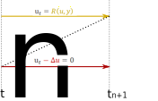

Operator Splitting
===================
An operator splitting scheme is used to solve e.g. a reaction diffusion equation. 

.. math::
  :label: reaction_diffision_eq
  
  u_t - Δu = R(u,y)

The equation is solved with only reaction and diffusion part separately.

.. _godunov:

  
  Scheme of Godunov splitting for :eq:`reaction_diffision_eq`
  
.. _strang:
.. figure:: images/strang.svg
  :width: 50%
   
  Scheme of Strang splitting for :eq:`reaction_diffision_eq`
  
.. _GodunovSplitting:

GodunovSplitting
-------------------

The Godunov operator splitting, as shown in :numref:`godunov` is first order consistent.

C++ code:

.. code-block:: c

  OperatorSplitting::Godunov<
    /*first timestepping scheme*/,
    /*second timestepping scheme*/
  >

Python settings:

.. code-block:: python

  "GodunovSplitting": {
    "numberTimeSteps": 1,
    "timeStepWidth": 1e-1,
    "endTime": 10.0,
    "logTimeStepWidthAsKey": "dt_3D",
    "durationLogKey": "duration_total",
    "timeStepOutputInterval": 10,
    
    "connectedSlotsTerm1To2": [0],  # list of slots of term 2 that are connected to the slots of term 1
    "connectedSlotsTerm2To1": [0],  # list of slots of term 1 that are connected to the slots of term 2
    
    "Term1": {
      "ExplicitEuler" : {  # these are the properties for the first timestepping
      }
    },
    "Term2": {
      "ImplicitEuler" : {  # these are the properties for the second timestepping
      }
    }
  }

As the GodunovSplitting is also a time stepping scheme, the common options described under :doc:`timestepping_schemes_ode` are also in use here.

The GodunovSplitting scheme perform two data transfers: 

* At the beginning from timestepping 1 to timestepping 2
* at the end from timestepping 2 to timestepping 1

The :doc:`coupling` class is the same as GodunovSplitting, except that the keyword is "Coupling" instead of "GodunovSplitting".

StrangSplitting
----------------

The Strang operator splitting, as shown in :numref:`strang` is first order consistent.

C++ code:

.. code-block:: c

  OperatorSplitting::Strang<
    /*first timestepping scheme*/,
    /*second timestepping scheme*/
  >

Python settings:

.. code-block:: python

  "StrangSplitting": {
    "numberTimeSteps": 1,
    "timeStepWidth": 1e-1,
    "endTime": 10.0,
    "logTimeStepWidthAsKey": "dt_3D",
    "durationLogKey": "duration_total",
    "timeStepOutputInterval": 10,
    
    "connectedSlotsTerm1To2": [0],  # list of slots of term 2 that are connected to the slots of term 1
    "connectedSlotsTerm2To1": [0],  # list of slots of term 1 that are connected to the slots of term 2
    
    "Term1": {
      "ExplicitEuler" : {  # these are the properties for the first timestepping
      }
    },
    "Term2": {
      "ImplicitEuler" : {  # these are the properties for the second timestepping
      }
    }
  }

As the StrangSplitting is also a time stepping scheme, the common options described under :doc:`timestepping_schemes_ode` are also in use here.
  
The StrangSplitting scheme perform two data transfers: 
* At the beginning from timestepping 1 to timestepping 2
* at the end from timestepping 2 to timestepping 1

Which values to transfer can be specified by the settings ``connectedSlotsTerm1To2`` 
and ``connectedSlotsTerm2To1``. See the notes on :doc:`/settings/output_connector_slots`.
