Existing examples
=======================

In the following all (or at least the most important) examples are listed. The order corresponds to the directory structure under `opendihu/examples`.

.. note::

  This list is not yet complete.

Laplace and Poisson
----------------------

This solves the Laplace equation

.. math::
  Δu = 0

with Dirichlet or Neumann-type boundary conditions. This models, e.g. diffusion or heat/electric conduction.
  
laplace1d
^^^^^^^^^^^^

This solves the laplace equation on a line, with linear and quadratic Lagrange ansatz functions or cubic Hermite ansatz functions. Neumann and Dirichlet-type boundary conditions are used.

.. code-block:: bash

  cd $OPENDIHU_HOME/examples/laplace/laplace1d
  mkorn && sr       # build
  cd build_release

Possible scenarios:

.. code-block:: bash

  ./laplace_linear ../settings_linear_quadratic_dirichlet.py      # (1)
  ./laplace_quadratic ../settings_linear_quadratic_dirichlet.py   # (2)
  ./laplace_quadratic ../settings_quadratic_neumann.py            # (3)
  ./laplace_hermite ../settings_hermite_neumann.py                # (4)
  ./laplace_hermite ../settings_hermite_dirichlet.py              # (5)

Output files will be written in the `out` subdirectory. The `*.py` files can be visualized by running ``plot``. The `*.vtr` file can be viewed with paraview. System matrices, solution and rhs vectors are dumped in matlab format.

.. _laplace1d_1:
.. figure:: examples/laplace1d_1.png
  :width: 50%
  
  Scenario (1).
  
.. _laplace1d_2:
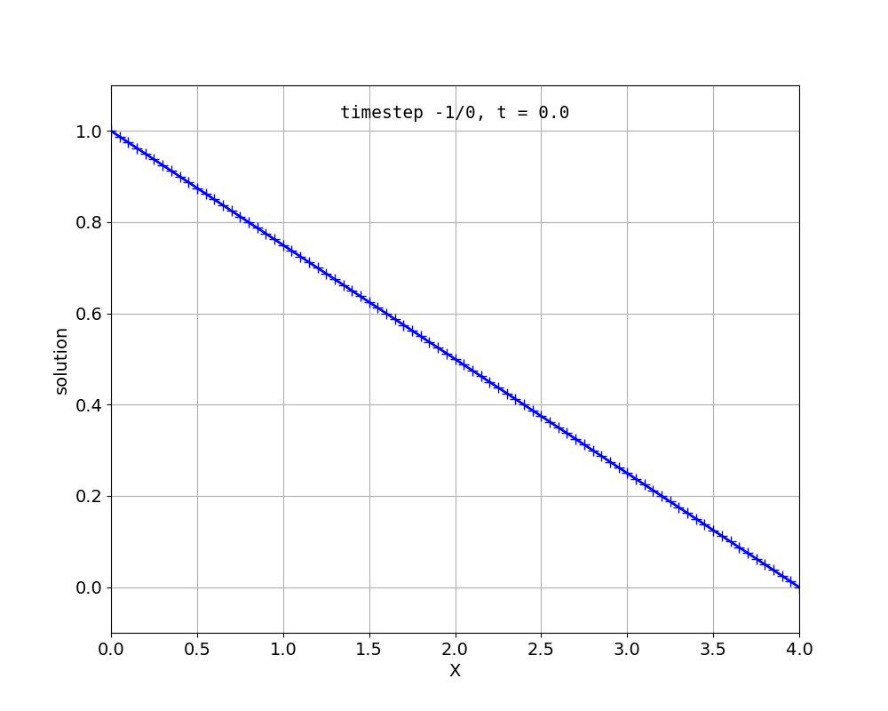
  
  Scenario (2).

.. _laplace1d_3:
.. figure:: examples/laplace1d_3.png
  :width: 50%
  
  Scenario (3).

.. _laplace1d_4:
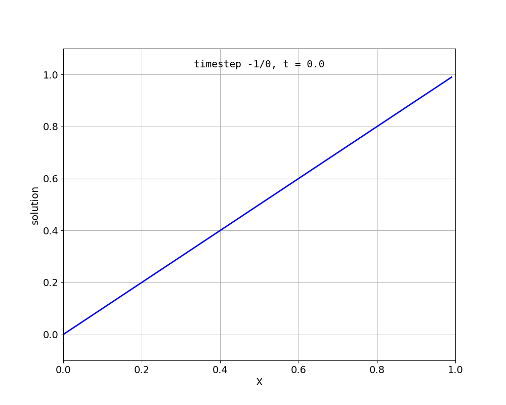
  
  Scenario (4).

.. _laplace1d_5:
.. figure:: examples/laplace1d_5.png
  :width: 50%
  
  Scenario (5). This is overconstrained, it leads to these oscillations.

laplace2d 
^^^^^^^^^^^^^^

This solves the 2d laplace equation, with linear and quadratic Lagrange ansatz functions or cubic Hermite ansatz functions. ``laplace_hermite`` demonstrates how to use unstructured grids.

.. code-block:: bash

  cd $OPENDIHU_HOME/examples/laplace/laplace2d
  mkorn && sr       # build
  cd build_release

Some possible scenarios, also others are possible:

.. code-block:: bash

  ./laplace_regular ../settings_lagrange_quadratic.py      # (1)
  ./laplace_structured ../settings_quadratic_neumann.py    # (2)
  ./laplace_hermite ../settings_hermite.py                 # (3)
  ./laplace_hermite ../settings_hermite_neumann.py         # (4)

.. _laplace2d_1:
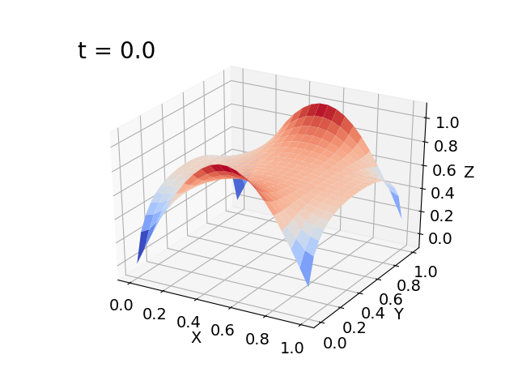
  
  Scenario (1).
  
.. _laplace2d_2:
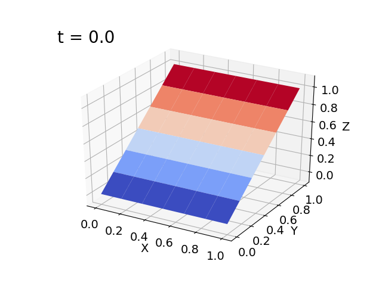
  
  Scenario (2).

.. _laplace2d_3:
.. figure:: examples/laplace2d_3.png
  :width: 50%
  
  Scenario (3).

.. _laplace2d_4:
.. figure:: examples/laplace2d_4.png
  :width: 50%
  
  Scenario (4). This was visualized using ParaView. The Neumann BC are shown by the arrows.

laplace3d 
^^^^^^^^^^^^^

This solves the 3d laplace equation.

.. code-block:: bash

  cd $OPENDIHU_HOME/examples/laplace/laplace3d
  mkorn && sr       # build
  cd build_release

Possible scenarios, more are possible and need adjustments in the settings files:

.. code-block:: bash

  mpirun -n 8 ./laplace_regular_fixed ../settings_neumann.py      # (1)
  ./laplace_structured_deformable ../settings_fat_tissue.py       # (2)
  mpirun -n 3 --oversubscribe ./petsc_test ../settings_dirichlet.py && echo "success" || echo "failed"

Note that the `plot` script only works for 1D and 2D data. For 3D data, Paraview is recommended.

.. _laplace3d_1:
.. figure:: examples/laplace3d_1.png
  :width: 60%
  
  Scenario (1). A simulation run with 8 processes, left: solution, right: partitioning.
  
.. _laplace3d_2:
.. figure:: examples/laplace3d_2.png
  :width: 60%
  
  Scenario (2). This simply shows the geometry.
  
laplace3d_surface
^^^^^^^^^^^^^^^^^^^^^
Solve the 3D Laplace problem and demonstrate how to use :doc:/settings/output_surface to extract a surface. This is needed if the full 3D data would be too large to output, but a 2D surface is okay.

.. code-block:: bash

  cd $OPENDIHU_HOME/examples/laplace/laplace3d_surface
  mkorn && sr       # build
  cd build_release

Possible scenarios, more are possible and need adjustments in the settings files:

.. code-block:: bash

  ./laplace_surface ../settings_surface.py                   # (1)
  mpirun -n 4 ./laplace_surface ../settings_surface.py       # (2)

.. _laplace3d_surface_1:
.. figure:: examples/laplace3d_surface_1.png
  :width: 60%
  
  Scenario (1). Left: the full mesh, right: only surface as written by the OutputSurface writer.
  
.. _laplace3d_surface_2:
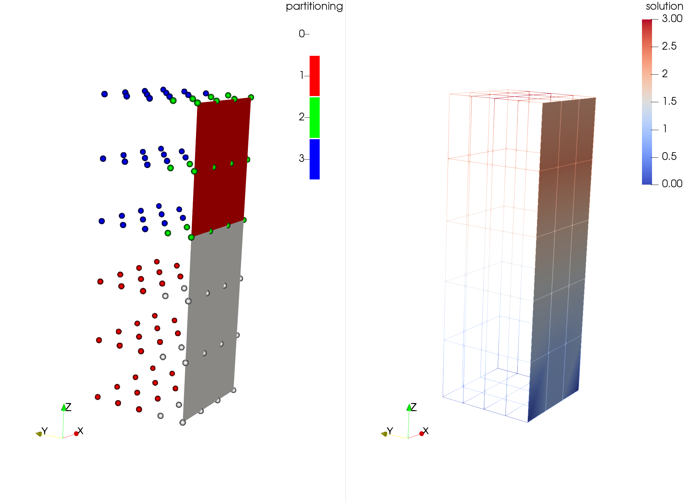
  
  Scenario (2). This shows that it also works with parallel execution (4 processes). Note how the surface is only written by two processes, whereas the volume is written by all 4 processes.

laplace_composite
^^^^^^^^^^^^^^^^^^^^
Demonstrate how to use a composite mesh.

.. code-block:: bash

  cd $OPENDIHU_HOME/examples/laplace/laplace_composite
  mkorn && sr       # build
  cd build_release

Possible scenarios:

.. code-block:: bash

  ./laplace_composite_2d ../settings_2d.py                   # (1)
  ./laplace_composite_3d ../settings_3d.py                   # (2)
  ./laplace_composite_linear_3d ../settings_linear_3d.py     # (3)
  ./laplace_composite_linear_2d ../settings_linear_2d.py     # (4)

.. _laplace_composite_1:
.. figure:: examples/laplace_composite_1.png
  :width: 60%
  
  Scenario (1).

.. _laplace_composite_2:
.. figure:: examples/laplace_composite_2.png
  :width: 60%
  
  Scenario (2). Two different views.
  
.. _laplace_composite_3:
.. figure:: examples/laplace_composite_3.png
  :width: 60%
  
  Scenario (3).
  
.. _laplace_composite_4:
.. figure:: examples/laplace_composite_4.png
  :width: 60%
  
  Scenario (4).

poisson1d
^^^^^^^^^^^^

This solves the poisson equation :math:`\partial^2 u/\partial x^2 = f` on a line.

.. code-block:: bash

  cd $OPENDIHU_HOME/examples/poisson/poisson1d
  mkorn && sr       # build
  cd build_release

Possible scenarios:

.. code-block:: bash

  ./poisson_example ../settings_1d.py      # (1)

Output files will be written in the `out` subdirectory. The `*.py` files can be visualized by running ``plot``. The written rhs vector in poisson_rhs_000.txt  is the weak form of the rhs!

.. _poisson1d_1:
.. figure:: examples/poisson1d_1.png
  :width: 40%
  
  Scenario (1).
  
poisson2d
^^^^^^^^^^^^

This solves the 2D poisson equation with a given right hand side,
  
.. math::
  Δu = f
  
This is very similar to the Laplace example.

.. code-block:: bash

  cd $OPENDIHU_HOME/examples/poisson/poisson2d
  mkorn && sr       # build
  cd build_release

Possible scenarios:

.. code-block:: bash

  ./poisson_example ../settings_2d.py      # (1)

Output files will be written in the `out` subdirectory. The `*.py` files can be visualized by running ``plot``. The written rhs vector in poisson_rhs_000.txt  is the weak form of the rhs!

.. _poisson2d_1:
.. figure:: examples/poisson2d_1.png
  :width: 40%
  
  Scenario (1).
  
Diffusion
-----------

This solves the diffusion equation

.. math::
  u_t - c\cdot Δu = 0

again with Dirichlet or Neumann-type boundary conditions and different initial values. There are again versions for different dimensionalities, `diffusion1d`, `diffusion2d` and  diffusion3d`.
  
diffusion1d
^^^^^^^^^^^^^^

.. code-block:: bash

  cd $OPENDIHU_HOME/examples/diffusion/diffusion1d
  mkorn && sr       # build
  cd build_release

Possible scenarios:

.. code-block:: bash

  ./diffusion_1d ../settings_diffusion.py      # (1)

.. _diffusion1d_1:
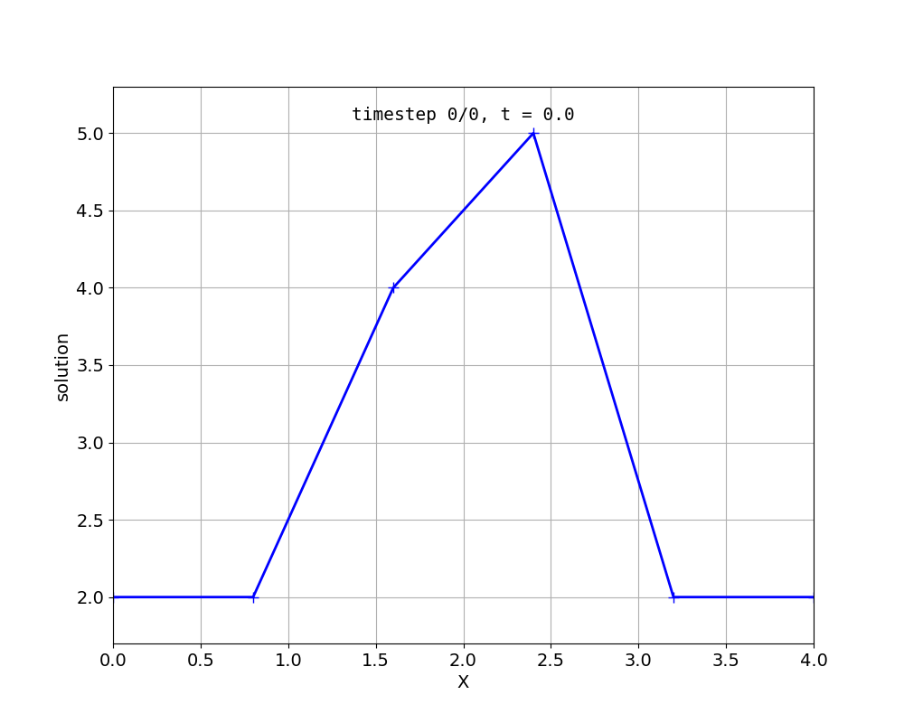
.. image:: examples/diffusion1d_2.png
  :width: 40%
  
Fig. First and last time step.

  
diffusion2d
^^^^^^^^^^^^^^

.. code-block:: bash

  cd $OPENDIHU_HOME/examples/diffusion/diffusion2d
  mkorn && sr       # build
  cd build_release

Possible scenarios:

.. code-block:: bash

  ./diffusion2d_1st_order ../settings_1st_order.py      # (1)
  ./diffusion2d_2nd_order ../settings_2nd_order.py      # (2)

If you run ``plot`` in the ``out`` folder it will show an animation. It is also possible to view the result in ParaView.

.. _diffusion2d_1:
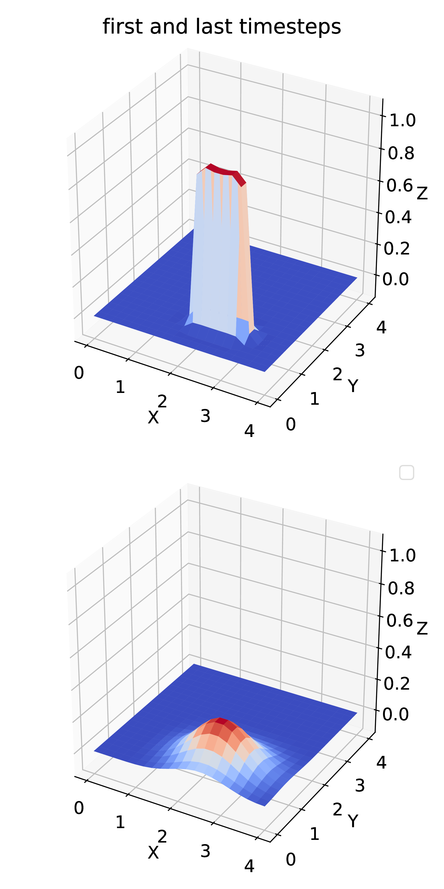
  
  Scenario (1), linear ansatz functions.

.. _diffusion2d_2:
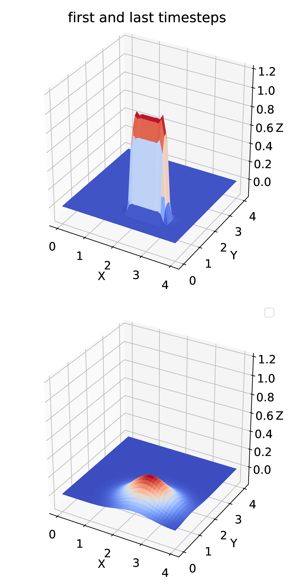
  
  Scenario (2), quadratic ansatz functions.
  
diffusion3d
^^^^^^^^^^^^^^^^^^^^^

.. code-block:: bash

  cd $OPENDIHU_HOME/examples/diffusion/diffusion3d
  mkorn && sr       # build
  cd build_release

Possible scenarios:

.. code-block:: bash

  mpirun -n 4 ./diffusion ../settings.py      # (1)

.. _diffusion3d_1:
.. figure:: examples/diffusion3d_1.png
  :width: 80%
  
  Scenario (1). Left: initial value, right: final value (volume rendering).

anisotropic_diffusion
^^^^^^^^^^^^^^^^^^^^^^^^^^

This solves the diffusion equation

.. math::
  u_t - \nabla\cdot \textbf{C} \nabla u = 0
  
with diffusion tensor :math:`\textbf{C}`.
  
.. code-block:: bash

  cd $OPENDIHU_HOME/examples/diffusion/diffusion3d
  mkorn && sr       # build
  cd build_release

Possible scenarios:

.. code-block:: bash

  ./anisotropic_diffusion2d ../settings2d.py              # (1)
  mpirun -n 4 ./anisotropic_diffusion2d ../settings2d.py  # (2)

This uses a multigrid solver of Petsc.

.. _anisotropic_diffusion3d_1:
.. figure:: examples/anisotropic_diffusion_1.png
  :width: 40%
  
  Scenarios (1) and (2) produce the same results. By comparing with :numref:`diffusion2d_2` it can be clearly seen that this is anisotropic.

reaction_diffusion2d
^^^^^^^^^^^^^^^^^^^^^^^^^^
This solves the diffusion equation with source term

.. math::
  u_t - cΔu = f(t)
  
with a source function :math:`f(x,t)`. This function defined in the python settings as callback function. This example demonstrates how to use the `PrescribedValues` class.

(Actually this is not a reaction diffusion equation, because :math:`f` does not depend on :math:`u`.)
  
.. code-block:: bash

  cd $OPENDIHU_HOME/examples/diffusion/reaction_diffusion2d
  mkorn && sr       # build
  cd build_release

Possible scenarios:

.. code-block:: bash

  ./reaction_diffusion_2d ../settings_reaction_diffusion2d.py              # (1)
  mpirun -n 4 ./reaction_diffusion_2d ../settings_reaction_diffusion2d.py  # (2)

.. _reaction_diffusion2d_1:
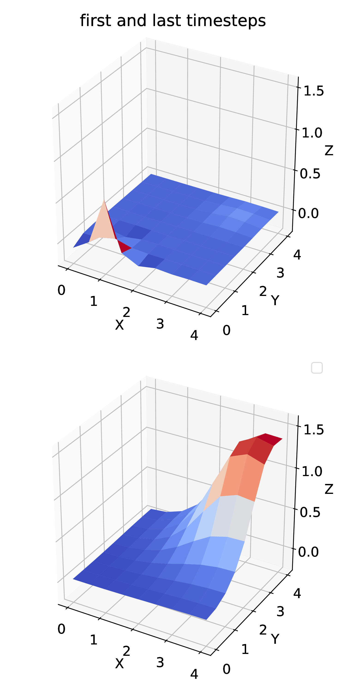
  
  Scenarios (1) and (2) produce the same results. Here, it makes sense to run ``plot`` in the ``out`` folder, to see the animation. The small peak at :math:`(0.55,0.25)` diffuses away, the callback function places a constant source at around :math:`(2.8,2.8)` which leads to the new maximum in the last timestep.

PinT_diffusion1d
^^^^^^^^^^^^^^^^^^^^

1D diffusion problem using the parallel-in-time algorithm "Multigrid reduction in time" (MGRIT) for the solution. This was done in the master thesis of Marius Nitzsche.

Fiber Tracing
---------------

parallel_fiber_estimation
^^^^^^^^^^^^^^^^^^^^^^^^^^^^^^^

* **parallel_fiber_estimation**

  Functionality to create fiber geometry for the Biceps Brachii muscle from a surface mesh of the muscle. This is very sophisticated and can be run in parallel.
  
streamline_tracer
^^^^^^^^^^^^^^^^^^^^^^^

Solid Mechanics
--------------------

linear_elasticity
^^^^^^^^^^^^^^^^^^^^^^^^^^^^^^^

For scenarios (1) and (2), this solves linear elasticity

.. math::
  \textbf{C}Δ\textbf{u} = \textbf{f}, \textbf{C} \in \mathbb{R}^2->\mathbb{R}^2, \textbf{u}, \textbf{f} \in \mathbb{R}^2
  
The 4th order elasticity tensor has the entries 

.. math:
  C_{abcd} = K \delta_{ab}  \delta_{cd} + \mu \big(\delta_{ac}  \delta_{bd} + \delta_{ad}  \delta_{bc} - \dfrac{2}{3}  \delta_{ab} \delta_{cd}\big);
  
with shear modulus :math:`\mu` and bulk modulus :math:`K`.
It shows how the normal `FiniteElementMethod` class can be used for this problem.

For scenarios (3), (4) and (5), it additionally considers an active stress term.
  
.. code-block:: bash

  cd $OPENDIHU_HOME/examples/examples/solid_mechanics/linear_elasticity/box
  mkorn && sr       # build
  cd build_release
  ./linear_elasticity_2d ../settings_linear_elasticity_2d.py    # (1)
  ./linear_elasticity_3d ../settings_linear_elasticity_3d.py    # (2)
  
  cd $OPENDIHU_HOME/examples/solid_mechanics/linear_elasticity/with_3d_activation
  mkorn && sr       # build
  cd build_release
  ./lin_elasticity_with_3d_activation_linear ../settings.py     # (3)
  ./lin_elasticity_with_3d_activation_quadratic ../settings.py  # (4) does not converge
  
  cd $OPENDIHU_HOME/examples/solid_mechanics/linear_elasticity/with_fiber_activation
  mkorn && sr       # build
  cd build_release
  ./lin_elasticity_with_fibers ../settings_fibers.py            # (5)

.. _linear_elasticity_1:
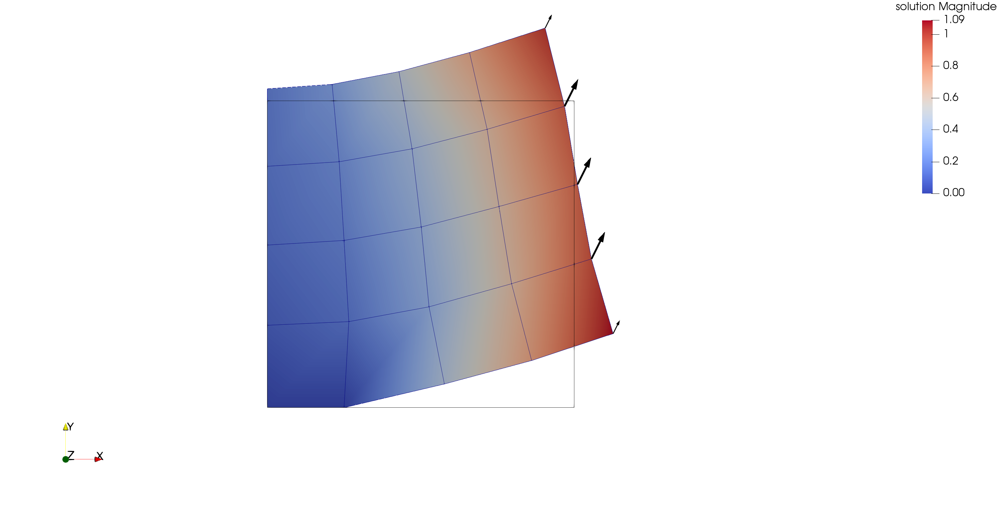
  
  Scenario (1): Neumann boundary conditions as black arrows (traction). This has been visualized using Arrow Glyphs and Warp filters in ParaView.

.. _linear_elasticity_2:
.. figure:: examples/linear_elasticity_2.png
  :width: 60%
  
  Scenario (2): Neumann boundary conditions as black arrows (traction). This has been visualized using Arrow Glyphs and Warp filters in ParaView.

.. _linear_elasticity_3:
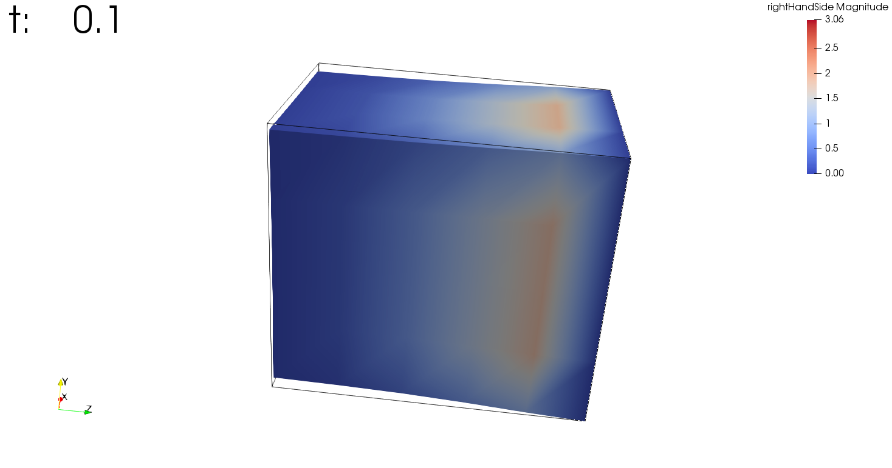
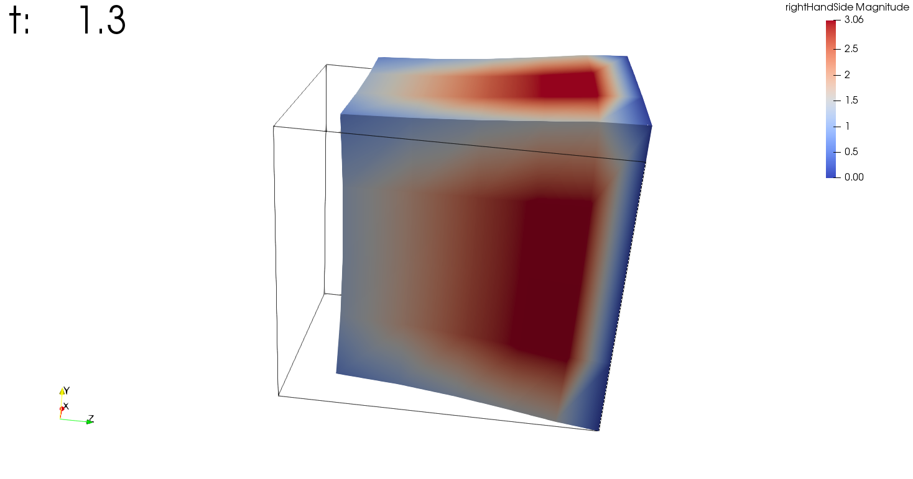
.. image:: examples/linear_elasticity_3_3.png
  :width: 24%
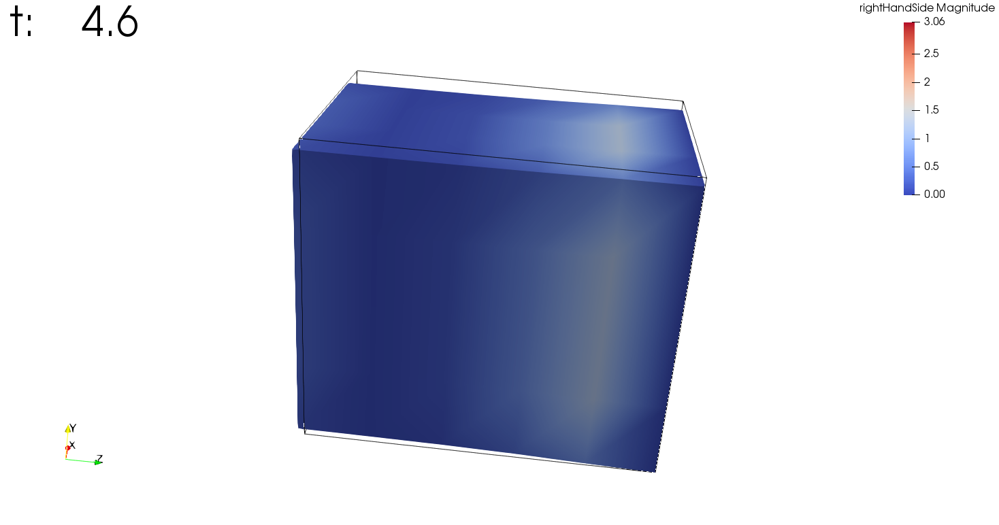
  
Scenario (3): This is a dynamic problem. An active stress value is prescribed over time in the 3D mesh and used in the elasticity computation. This simulates a periodically contracting muscle.

.. _linear_elasticity_5:
.. image:: examples/linear_elasticity_5_1.png
  :width: 49%
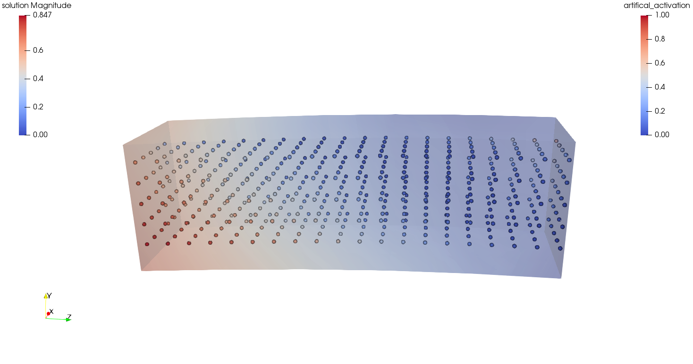
  
Scenario (5): An active stress value is prescribed over time at multiple 1D fibers (shown as spheres). This value gets mapped to the 3D mesh and used in the elasticity computation. This can also be seen as muscle tissue, which is bending up and down periodically.

mooney_rivlin_isotropic
^^^^^^^^^^^^^^^^^^^^^^^^^^^^^^^

Solves a static 3D nonlinear, incompressible solid mechanics problem with Mooney-Rivlin material. The strain energy function is formulated using the reduced invariants as follows.

.. math::
 
  Ψ_\text{iso}(\bar{I},\bar{I}_2) = c_1 (\bar{I}_1 - 3) + c_2 (\bar{I}_2 - 3)

.. code-block:: bash

  cd $OPENDIHU_HOME/examples/solid_mechanics/mooney_rivlin_isotropic
  mkorn && sr       # build
  cd build_release

Possible scenarios:

.. code-block:: bash

  ./3d_hyperelasticity ../settings_3d_box.py      # (1)
  ./3d_hyperelasticity ../settings_3d_muscle.py   # (2)

.. _mooney_rivlin_isotropic_1:
.. figure:: examples/mooney_rivlin_isotropic_1.png
  :width: 60%
  
  Scenario (1): A deformed box, material parameters :math:`c_1=0, c_2=1`. The box is fixed at the left plane. The arrows visualize the traction.

.. _mooney_rivlin_isotropic_2:
.. figure:: examples/mooney_rivlin_isotropic_2.png
  :width: 60%
  
  Scenario (2): A deformed muscle geometry. Material parameters :math:`c_1 = 3.176e-10, c_2 = 1.813` [N/cm^2]. The muscle is fixed at the top end, a force acts at the bottom end.

.. _mooney_rivlin_isotropic_3:
.. figure:: examples/mooney_rivlin_isotropic_3.png
  :width: 60%
  
  The residual norm of the nonlinear solver over time steps. The Jacobian matrix is formed analytically every 5th iteration, in total three times (before iterations 1, 6, 11). It can be seen that the residual norm drops after every new Jacobian and then only increases a little more.

mooney_rivlin_transiso
^^^^^^^^^^^^^^^^^^^^^^^^^^^^^^^

Solves a static 3D nonlinear solid mechanics problem, now with transversely isotropic Mooney-Rivlin material, i.e. with 4 material parameters.
 The strain energy function is formulated using the reduced invariants as follows.

.. math::
 
  Ψ_\text{iso}(\bar{I},\bar{I}_2,\bar{I}_4,\bar{I}_5) 
    = c_1 (\bar{I}_1 - 3) + c_2 (\bar{I}_2 - 3) + \dfrac{b}{d} (\lambda^d - 1) - b\,ln(\lambda),\\
     \lambda = \sqrt{\bar{I}_4}
    
.. code-block:: bash

  cd $OPENDIHU_HOME/examples/solid_mechanics/mooney_rivlin_transiso
  mkorn && sr       # build
  cd build_release

Possible scenarios:

.. code-block:: bash

  ./3d_hyperelasticity ../settings_3d_box.py      # (1)
  ./3d_hyperelasticity ../settings_3d_muscle.py   # (2)

.. _mooney_rivlin_transiso_1:
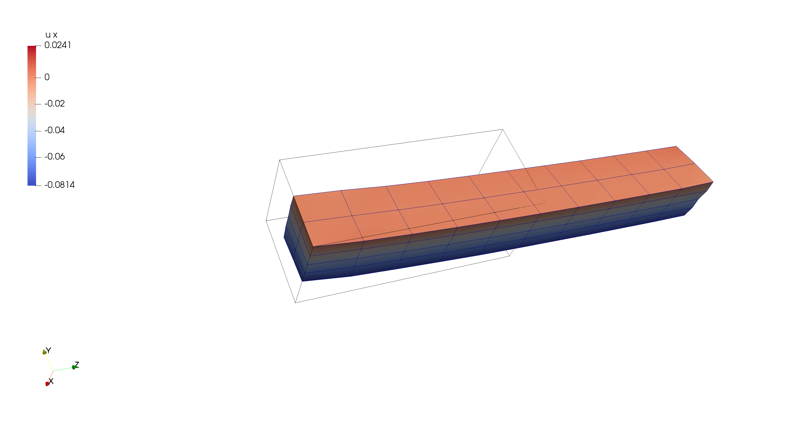
  
  Scenario (1): A deformed box. The box is fixed at the left plane, it contains diagonal internal fibers that are oriented by 40 degrees away from the center line. Material parameters are :math:`c_1=2, c_2=3, b_1=4, d_1=5`. The rod is only pulled towards the right, not to the bottom. The displacements are enlarged by the factor 10. It can be seen that by the anistropic material, it behaves asymmetrically.

.. _mooney_rivlin_transiso_2:
.. figure:: examples/mooney_rivlin_transiso_2.png
  :width: 60%
  
  Scenario (2): A deformed muscle geometry, material parameters :math:`c_1 = 3.176e-10, c_2 = 1.813, b  = 1.075e-2, d  = 9.1733`. The muscle is fixed at the left end and pulled upwards by a force of 0.1 N.

dynamic_mooney_rivlin
^^^^^^^^^^^^^^^^^^^^^^^^^^^^^^^

.. code-block:: bash

  cd $OPENDIHU_HOME/examples/examples/solid_mechanics/dynamic_mooney_rivlin/rod
  mkorn && sr       # build
  cd build_release
  ./linear_elasticity_2d ../settings_linear_elasticity_2d.py    # (1)
  ./linear_elasticity_3d ../settings_linear_elasticity_3d.py    # (2)
  
  cd $OPENDIHU_HOME/examples/examples/solid_mechanics/dynamic_mooney_rivlin/gelatine1
  mkorn && sr       # build
  cd build_release
  ./linear_elasticity_2d ../settings_linear_elasticity_2d.py    # (1)
  ./linear_elasticity_3d ../settings_linear_elasticity_3d.py    # (2)
  
  cd $OPENDIHU_HOME/examples/solid_mechanics/dynamic_mooney_rivlin/gelatine2
  mkorn && sr       # build
  cd build_release
  ./lin_elasticity_with_3d_activation_linear ../settings.py     # (3)
  ./lin_elasticity_with_3d_activation_quadratic ../settings.py  # (4) does not converge
  
  cd $OPENDIHU_HOME/examples/solid_mechanics/dynamic_mooney_rivlin/muscle
  mkorn && sr       # build
  cd build_release
  ./lin_elasticity_with_fibers ../settings_fibers.py            # (5)

  cd $OPENDIHU_HOME/examples/solid_mechanics/dynamic_mooney_rivlin/muscle_with_fat
  mkorn && sr       # build
  cd build_release
  ./lin_elasticity_with_fibers ../settings_fibers.py            # (5)

  cd $OPENDIHU_HOME/examples/solid_mechanics/dynamic_mooney_rivlin/tendon
  mkorn && sr       # build
  cd build_release
  ./lin_elasticity_with_fibers ../settings_fibers.py            # (5)

.. _linear_elasticity_1:

  
  Scenario (1): Neumann boundary conditions as black arrows (traction). This has been visualized using Arrow Glyphs and Warp filters in ParaView.

.. _linear_elasticity_2:
.. figure:: examples/linear_elasticity_2.png
  :width: 60%
  

mooney_rivlin_febio
^^^^^^^^^^^^^^^^^^^^^^^^^^^^^^^
shear_test
^^^^^^^^^^^^^^^^^^^^^^^^^^^^^^^
tensile_test
^^^^^^^^^^^^^^^^^^^^^^^^^^^^^^^
Chaste
^^^^^^^^^^^^^^^^^^^^^^^^^^^^^^^
This example is for testing the Chaste integration in opendihu. It uses the hyperelasticity implementation of chaste if chaste has been installed.
It solves the nonlinear finite elasticity problem with Mooney-Rivlin material, for either 2D or 3D.

Because Chaste is not able to solve nonlinear elasticity in parallel, nor solve anything else than the quasi-static case,
integration in opendihu is not complete. This class should be deleted.

Electrophysiology
--------------------
Cellml
^^^^^^^^^
A single subcellular point, i.e. one instance of a CellML problem

* **svd_mor**

  Model order reduction examples, ask Nehzat.
  
* **load_balancing**

  Electrophysiology of a small number of fibers where load balancing and time adaptivity is considered, this was a Bachelor thesis supervised by Benjamin.
  
* **quadrature**

  Small test example to compare different quadrature schemes, this was from a seminar and is not used anymore.
  
Monodomain
^^^^^^^^^^^

  * **hodgkin_huxley**
  
    A single fiber using the Hodgkin-Huxley CellML-model, i.e. Monodomain
    
  * **cellml_on_gpu**

    Effort to bring Monodomain computation on GPU, ask Aaron.
    
  * **shorten**
  
    Same as hodgkin_huxley, i.e. one fiber, but it uses the Shorten model instead of Hodgkin-Huxley.

Fibers
^^^^^^^^^^^

  * **multiple_fibers**
  
    Multiple instances of the Monodomain equation, i.e. multiple fibers with electrophysiology. The fibers are not subdivided into several subdomains. When using multiple processes, every process simulates whole fibers
  * **multiple_fibers_cubes_partitioning**
  
    Again multiple fibers but this time they can be subdivided such that every process can compute a "cubic" subdomain that contains parts of several fibers.
  * **fibers_emg**
  
    This is the *main* example for multiple fibers. Again multiple fibers can be subdivided, furthermore everything is coupled to a static bidomain equation. This example was used for large-scale tests on Hazel Hen (supercomputer in Stuttgart until 2019) and was successfully executed for 270.000 fibers on 27.000 cores.
  * **cuboid**
  
    Whereas all previous examples use biceps brachii geometry, this example is simply a cuboid and does not need any geometry information at all. Only here, the number of nodes per fiber can be adjusted.
    
Multidomain
^^^^^^^^^^^
- **multidomain3d**

  The multidomain equations which are a 3D homogenized formulation of electrophysiology.
  
Neuromuscular
^^^^^^^^^^^^^^^
