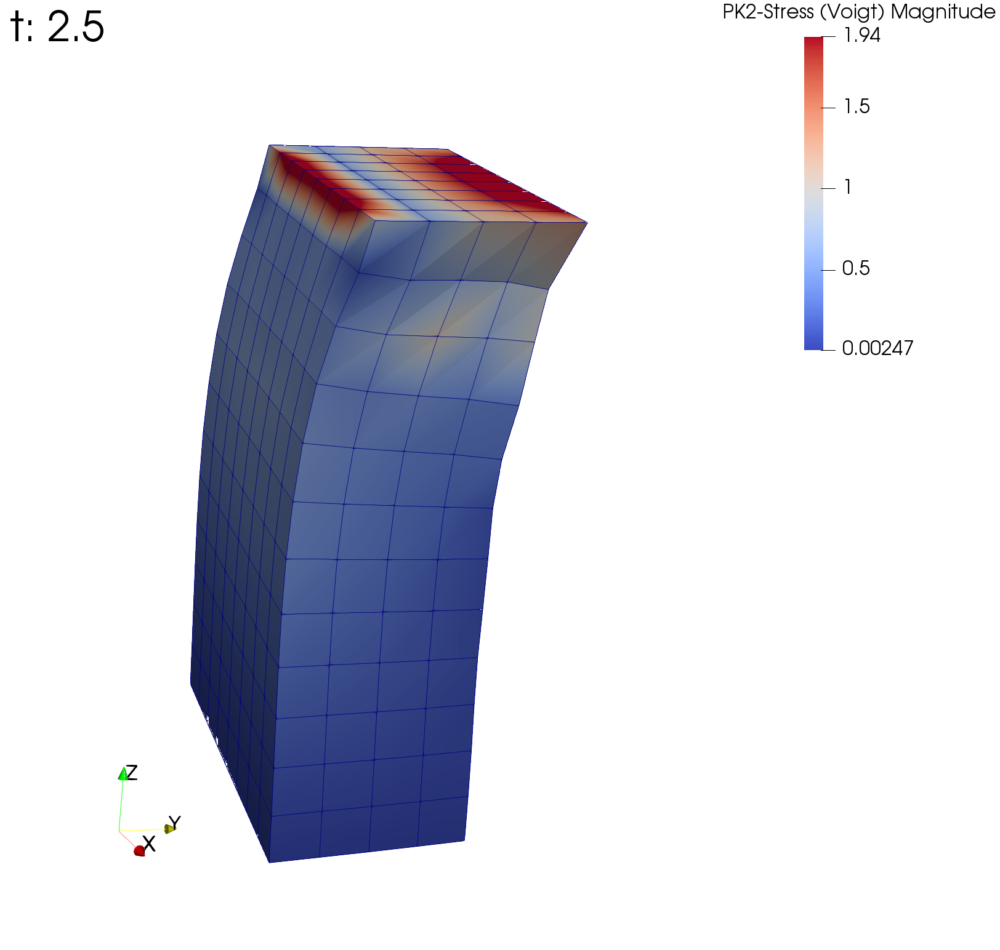
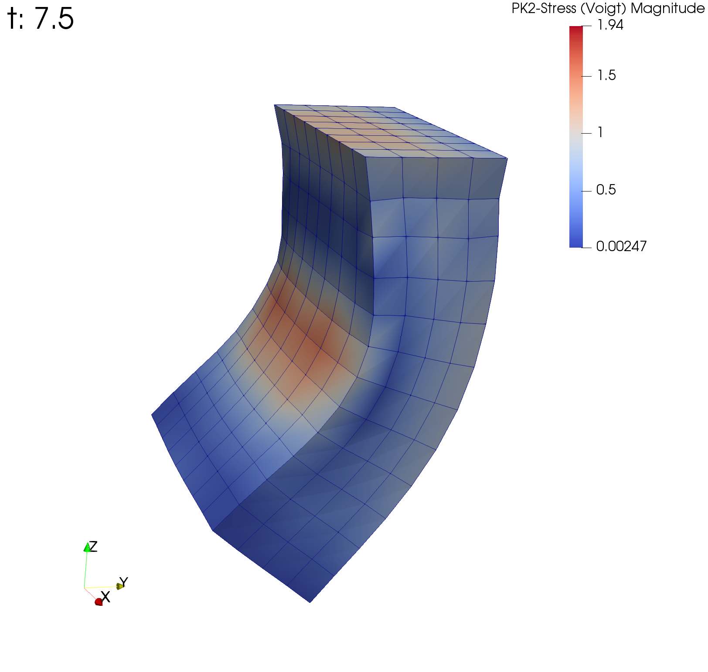
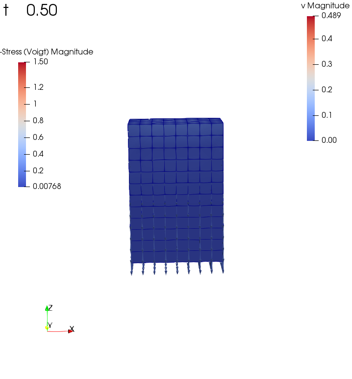
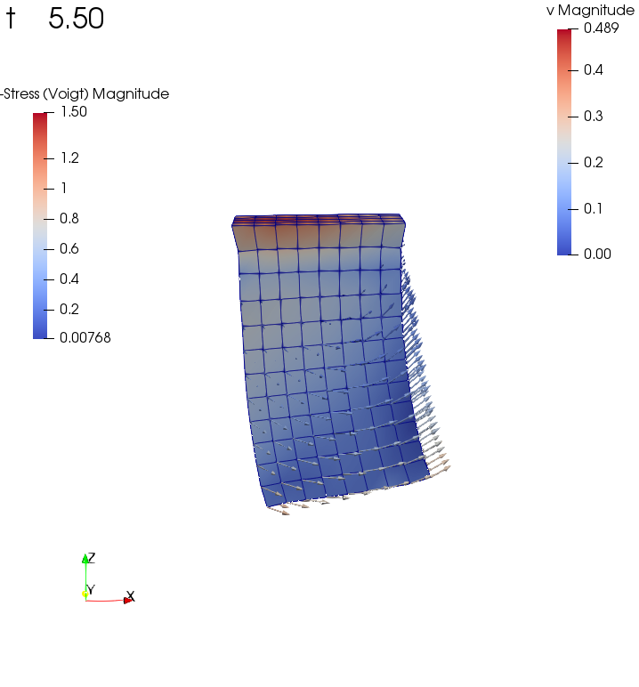
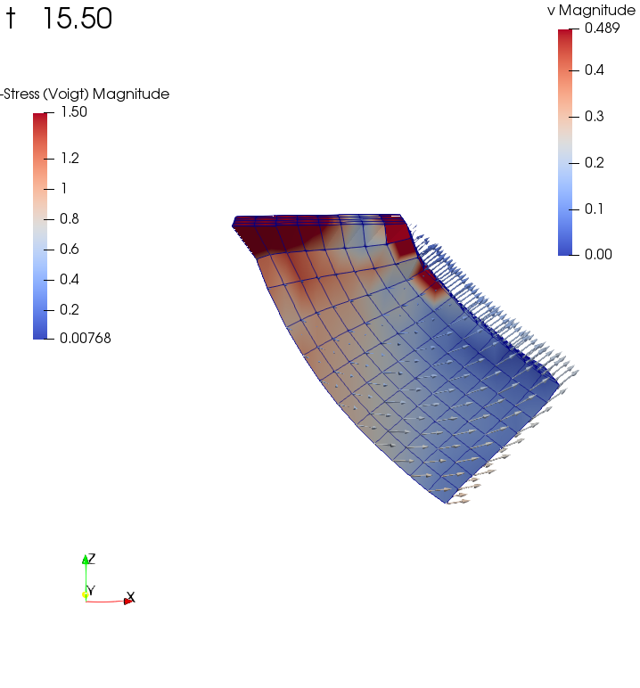
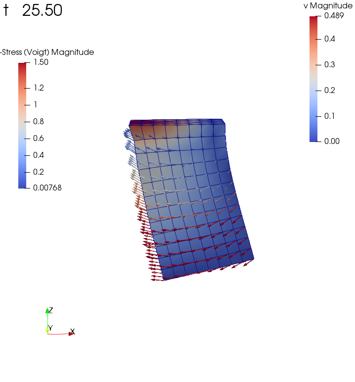
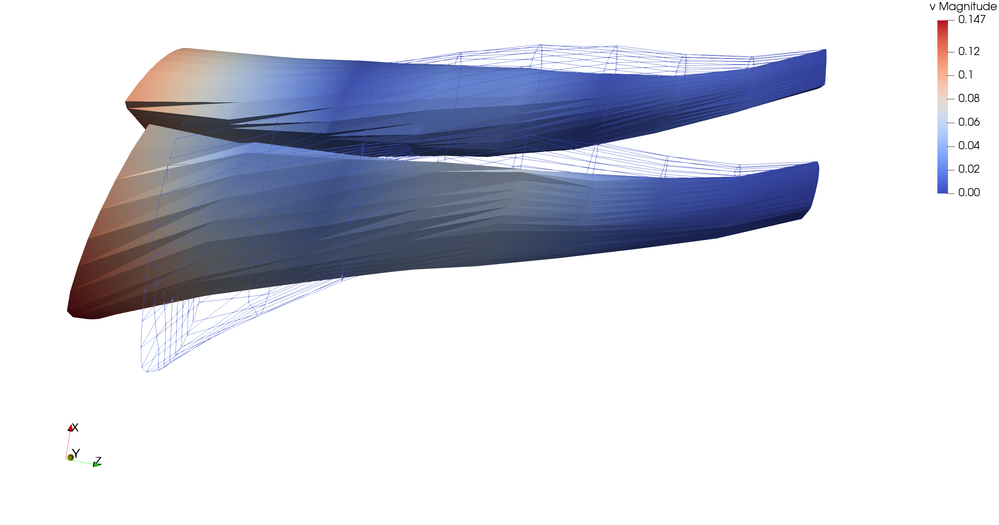
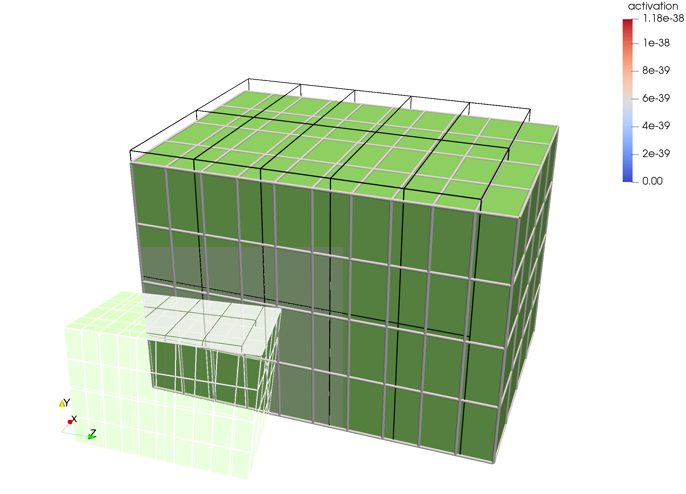
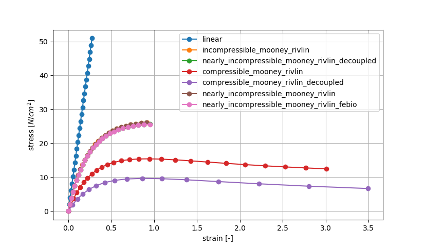
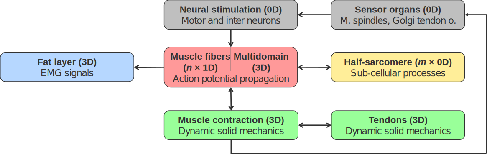

Existing examples
=======================

In the following all (or at least the most important) examples are listed. The order corresponds to the directory structure under `opendihu/examples`.

.. note::

  This list is not yet complete.

Laplace and Poisson
----------------------

This solves the Laplace equation

.. math::
  Δu = 0

with Dirichlet or Neumann-type boundary conditions. This models, e.g. diffusion or heat/electric conduction.
  
laplace1d
^^^^^^^^^^^^

This solves the laplace equation on a line, with linear and quadratic Lagrange ansatz functions or cubic Hermite ansatz functions. Neumann and Dirichlet-type boundary conditions are used.

.. code-block:: bash

  cd $OPENDIHU_HOME/examples/laplace/laplace1d
  mkorn && sr       # build
  cd build_release

Possible scenarios:

.. code-block:: bash

  ./laplace_linear ../settings_linear_quadratic_dirichlet.py      # (1)
  ./laplace_quadratic ../settings_linear_quadratic_dirichlet.py   # (2)
  ./laplace_quadratic ../settings_quadratic_neumann.py            # (3)
  ./laplace_hermite ../settings_hermite_neumann.py                # (4)
  ./laplace_hermite ../settings_hermite_dirichlet.py              # (5)

Output files will be written in the `out` subdirectory. The `*.py` files can be visualized by running ``plot``. The `*.vtr` file can be viewed with paraview. System matrices, solution and rhs vectors are dumped in matlab format.

.. _laplace1d_1:
.. figure:: examples/laplace1d_1.png
  :width: 50%
  
  Scenario (1).
  
.. _laplace1d_2:
.. figure:: examples/laplace1d_2.png
  :width: 50%
  
  Scenario (2).

.. _laplace1d_3:
.. figure:: examples/laplace1d_3.png
  :width: 50%
  
  Scenario (3).

.. _laplace1d_4:
.. figure:: examples/laplace1d_4.png
  :width: 50%
  
  Scenario (4).

.. _laplace1d_5:
.. figure:: examples/laplace1d_5.png
  :width: 50%
  
  Scenario (5). This is overconstrained, it leads to these oscillations.

laplace2d 
^^^^^^^^^^^^^^

This solves the 2d laplace equation, with linear and quadratic Lagrange ansatz functions or cubic Hermite ansatz functions. ``laplace_hermite`` demonstrates how to use unstructured grids.

.. code-block:: bash

  cd $OPENDIHU_HOME/examples/laplace/laplace2d
  mkorn && sr       # build
  cd build_release

Some possible scenarios, also others are possible:

.. code-block:: bash

  ./laplace_regular ../settings_lagrange_quadratic.py      # (1)
  ./laplace_structured ../settings_quadratic_neumann.py    # (2)
  ./laplace_hermite ../settings_hermite.py                 # (3)
  ./laplace_hermite ../settings_hermite_neumann.py         # (4)

.. _laplace2d_1:
.. figure:: examples/laplace2d_1.png
  :width: 50%
  
  Scenario (1).
  
.. _laplace2d_2:
.. figure:: examples/laplace2d_2.png
  :width: 50%
  
  Scenario (2).

.. _laplace2d_3:
.. figure:: examples/laplace2d_3.png
  :width: 50%
  
  Scenario (3).

.. _laplace2d_4:
.. figure:: examples/laplace2d_4.png
  :width: 50%
  
  Scenario (4). This was visualized using ParaView. The Neumann BC are shown by the arrows.

laplace3d 
^^^^^^^^^^^^^

This solves the 3d laplace equation.

.. code-block:: bash

  cd $OPENDIHU_HOME/examples/laplace/laplace3d
  mkorn && sr       # build
  cd build_release

Possible scenarios, more are possible and need adjustments in the settings files:

.. code-block:: bash

  mpirun -n 8 ./laplace_regular_fixed ../settings_neumann.py      # (1)
  ./laplace_structured_deformable ../settings_fat_tissue.py       # (2)
  mpirun -n 3 --oversubscribe ./petsc_test ../settings_dirichlet.py && echo "success" || echo "failed"

Note that the `plot` script only works for 1D and 2D data. For 3D data, Paraview is recommended.

.. _laplace3d_1:
.. figure:: examples/laplace3d_1.png
  :width: 60%
  
  Scenario (1). A simulation run with 8 processes, left: solution, right: partitioning.
  
.. _laplace3d_2:
.. figure:: examples/laplace3d_2.png
  :width: 60%
  
  Scenario (2). This simply shows the geometry.
  
laplace3d_surface
^^^^^^^^^^^^^^^^^^^^^
Solve the 3D Laplace problem and demonstrate how to use :doc:/settings/output_surface to extract a surface. This is needed if the full 3D data would be too large to output, but a 2D surface is okay.

.. code-block:: bash

  cd $OPENDIHU_HOME/examples/laplace/laplace3d_surface
  mkorn && sr       # build
  cd build_release

Possible scenarios, more are possible and need adjustments in the settings files:

.. code-block:: bash

  ./laplace_surface ../settings_surface.py                   # (1)
  mpirun -n 4 ./laplace_surface ../settings_surface.py       # (2)

.. _laplace3d_surface_1:
.. figure:: examples/laplace3d_surface_1.png
  :width: 60%
  
  Scenario (1). Left: the full mesh, right: only surface as written by the OutputSurface writer.
  
.. _laplace3d_surface_2:
.. figure:: examples/laplace3d_surface_2.png
  :width: 60%
  
  Scenario (2). This shows that it also works with parallel execution (4 processes). Note how the surface is only written by two processes, whereas the volume is written by all 4 processes.

laplace_composite
^^^^^^^^^^^^^^^^^^^^
Demonstrate how to use a composite mesh.

.. code-block:: bash

  cd $OPENDIHU_HOME/examples/laplace/laplace_composite
  mkorn && sr       # build
  cd build_release

Possible scenarios:

.. code-block:: bash

  ./laplace_composite_2d ../settings_2d.py                   # (1)
  ./laplace_composite_3d ../settings_3d.py                   # (2)
  ./laplace_composite_linear_3d ../settings_linear_3d.py     # (3)
  ./laplace_composite_linear_2d ../settings_linear_2d.py     # (4)

.. _laplace_composite_1:
.. figure:: examples/laplace_composite_1.png
  :width: 60%
  
  Scenario (1).

.. _laplace_composite_2:
.. figure:: examples/laplace_composite_2.png
  :width: 60%
  
  Scenario (2). Two different views.
  
.. _laplace_composite_3:
.. figure:: examples/laplace_composite_3.png
  :width: 60%
  
  Scenario (3).
  
.. _laplace_composite_4:
.. figure:: examples/laplace_composite_4.png
  :width: 60%
  
  Scenario (4).

poisson1d
^^^^^^^^^^^^

This solves the poisson equation :math:`\partial^2 u/\partial x^2 = f` on a line.

.. code-block:: bash

  cd $OPENDIHU_HOME/examples/poisson/poisson1d
  mkorn && sr       # build
  cd build_release

Possible scenarios:

.. code-block:: bash

  ./poisson_example ../settings_1d.py      # (1)

Output files will be written in the `out` subdirectory. The `*.py` files can be visualized by running ``plot``. The written rhs vector in poisson_rhs_000.txt  is the weak form of the rhs!

.. _poisson1d_1:
.. figure:: examples/poisson1d_1.png
  :width: 40%
  
  Scenario (1).
  
poisson2d
^^^^^^^^^^^^

This solves the 2D poisson equation with a given right hand side,
  
.. math::
  Δu = f
  
This is very similar to the Laplace example.

.. code-block:: bash

  cd $OPENDIHU_HOME/examples/poisson/poisson2d
  mkorn && sr       # build
  cd build_release

Possible scenarios:

.. code-block:: bash

  ./poisson_example ../settings_2d.py      # (1)

Output files will be written in the `out` subdirectory. The `*.py` files can be visualized by running ``plot``. The written rhs vector in poisson_rhs_000.txt  is the weak form of the rhs!

.. _poisson2d_1:
.. figure:: examples/poisson2d_1.png
  :width: 40%
  
  Scenario (1).
  
Diffusion
-----------

This solves the diffusion equation

.. math::
  u_t - c\cdot Δu = 0

again with Dirichlet or Neumann-type boundary conditions and different initial values. There are again versions for different dimensionalities, `diffusion1d`, `diffusion2d` and  diffusion3d`.
  
diffusion1d
^^^^^^^^^^^^^^

.. code-block:: bash

  cd $OPENDIHU_HOME/examples/diffusion/diffusion1d
  mkorn && sr       # build
  cd build_release

Possible scenarios:

.. code-block:: bash

  ./diffusion_1d ../settings_diffusion.py      # (1)

.. _diffusion1d_1:
.. image:: examples/diffusion1d_1.png
  :width: 40%
.. image:: examples/diffusion1d_2.png
  :width: 40%
  
Fig. First and last time step.

  
diffusion2d
^^^^^^^^^^^^^^

.. code-block:: bash

  cd $OPENDIHU_HOME/examples/diffusion/diffusion2d
  mkorn && sr       # build
  cd build_release

Possible scenarios:

.. code-block:: bash

  ./diffusion2d_1st_order ../settings_1st_order.py      # (1)
  ./diffusion2d_2nd_order ../settings_2nd_order.py      # (2)

If you run ``plot`` in the ``out`` folder it will show an animation. It is also possible to view the result in ParaView.

.. _diffusion2d_1:
.. figure:: examples/diffusion2d_1.png
  :width: 50%
  
  Scenario (1), linear ansatz functions.

.. _diffusion2d_2:
.. figure:: examples/diffusion2d_2.png
  :width: 50%
  
  Scenario (2), quadratic ansatz functions.
  
diffusion3d
^^^^^^^^^^^^^^^^^^^^^

.. code-block:: bash

  cd $OPENDIHU_HOME/examples/diffusion/diffusion3d
  mkorn && sr       # build
  cd build_release

Possible scenarios:

.. code-block:: bash

  mpirun -n 4 ./diffusion ../settings.py      # (1)

.. _diffusion3d_1:
.. figure:: examples/diffusion3d_1.png
  :width: 80%
  
  Scenario (1). Left: initial value, right: final value (volume rendering).

anisotropic_diffusion
^^^^^^^^^^^^^^^^^^^^^^^^^^

This solves the diffusion equation

.. math::
  u_t - \nabla\cdot \textbf{C} \nabla u = 0
  
with diffusion tensor :math:`\textbf{C}`.
  
.. code-block:: bash

  cd $OPENDIHU_HOME/examples/diffusion/diffusion3d
  mkorn && sr       # build
  cd build_release

Possible scenarios:

.. code-block:: bash

  ./anisotropic_diffusion2d ../settings2d.py              # (1)
  mpirun -n 4 ./anisotropic_diffusion2d ../settings2d.py  # (2)

This uses a multigrid solver of Petsc.

.. _anisotropic_diffusion3d_1:
.. figure:: examples/anisotropic_diffusion_1.png
  :width: 40%
  
  Scenarios (1) and (2) produce the same results. By comparing with :numref:`diffusion2d_2` it can be clearly seen that this is anisotropic.

reaction_diffusion2d
^^^^^^^^^^^^^^^^^^^^^^^^^^
This solves the diffusion equation with source term

.. math::
  u_t - cΔu = f(t)
  
with a source function :math:`f(x,t)`. This function defined in the python settings as callback function. This example demonstrates how to use the `PrescribedValues` class.

(Actually this is not a reaction diffusion equation, because :math:`f` does not depend on :math:`u`.)
  
.. code-block:: bash

  cd $OPENDIHU_HOME/examples/diffusion/reaction_diffusion2d
  mkorn && sr       # build
  cd build_release

Possible scenarios:

.. code-block:: bash

  ./reaction_diffusion_2d ../settings_reaction_diffusion2d.py              # (1)
  mpirun -n 4 ./reaction_diffusion_2d ../settings_reaction_diffusion2d.py  # (2)

.. _reaction_diffusion2d_1:
.. figure:: examples/reaction_diffusion2d_1.png
  :width: 40%
  
  Scenarios (1) and (2) produce the same results. Here, it makes sense to run ``plot`` in the ``out`` folder, to see the animation. The small peak at :math:`(0.55,0.25)` diffuses away, the callback function places a constant source at around :math:`(2.8,2.8)` which leads to the new maximum in the last timestep.

PinT_diffusion1d
^^^^^^^^^^^^^^^^^^^^

1D diffusion problem using the parallel-in-time algorithm "Multigrid reduction in time" (MGRIT) for the solution. This was done in the master thesis of Marius Nitzsche.

Fiber Tracing
---------------

parallel_fiber_estimation
^^^^^^^^^^^^^^^^^^^^^^^^^^^^^^^

* **parallel_fiber_estimation**

  Functionality to create fiber geometry for the Biceps Brachii muscle from a surface mesh of the muscle. This is very sophisticated and can be run in parallel.
  
streamline_tracer
^^^^^^^^^^^^^^^^^^^^^^^

Solid Mechanics
--------------------

Linear Elasticity
^^^^^^^^^^^^^^^^^^^^^^^^^^^^^^^

For scenarios (1) and (2), this solves linear elasticity

.. math::
  \textbf{C}Δ\textbf{u} = \textbf{f}, \textbf{C} \in \mathbb{R}^2\times\mathbb{R}^2, \textbf{u}, \textbf{f} \in \mathbb{R}^2
  
The 4th order elasticity tensor has the entries 

.. math::

  C_{abcd} = K \delta_{ab}  \delta_{cd} + \mu \big(\delta_{ac}  \delta_{bd} + \delta_{ad}  \delta_{bc} - \dfrac{2}{3}  \delta_{ab} \delta_{cd}\big)
  
with shear modulus :math:`\mu` and bulk modulus :math:`K`.
It shows how the normal `FiniteElementMethod` class can be used for this problem.

For scenarios (3), (4) and (5), an active stress term is additionally considered, such that the 2nd Piola-Kirchhoff stress tensor is given as :math:`S = S_\text{passive} + S_\text{active}`.
  
.. code-block:: bash

  cd $OPENDIHU_HOME/examples/solid_mechanics/linear_elasticity/box
  mkorn && sr       # build
  cd build_release
  ./linear_elasticity_2d ../settings_linear_elasticity_2d.py    # (1)
  ./linear_elasticity_3d ../settings_linear_elasticity_3d.py    # (2)
  
  cd $OPENDIHU_HOME/examples/solid_mechanics/linear_elasticity/with_3d_activation
  mkorn && sr       # build
  cd build_release
  ./lin_elasticity_with_3d_activation_linear ../settings.py     # (3)
  ./lin_elasticity_with_3d_activation_quadratic ../settings.py  # (4) does not converge
  
  cd $OPENDIHU_HOME/examples/solid_mechanics/linear_elasticity/with_fiber_activation
  mkorn && sr       # build
  cd build_release
  ./lin_elasticity_with_fibers ../settings_fibers.py            # (5)

.. _linear_elasticity_1:
.. figure:: examples/linear_elasticity_1.png
  :width: 60%
  
  Scenario (1): Neumann boundary conditions as black arrows (traction). This has been visualized using Arrow Glyphs and Warp filters in ParaView.

.. _linear_elasticity_2:
.. figure:: examples/linear_elasticity_2.png
  :width: 60%
  
  Scenario (2): Neumann boundary conditions as black arrows (traction). This has been visualized using Arrow Glyphs and Warp filters in ParaView.

.. _linear_elasticity_3:
.. image:: examples/linear_elasticity_3_1.png
  :width: 24%
.. image:: examples/linear_elasticity_3_2.png
  :width: 24%
.. image:: examples/linear_elasticity_3_3.png
  :width: 24%
.. image:: examples/linear_elasticity_3_4.png
  :width: 24%
  
Scenario (3): This is a dynamic problem. An active stress value is prescribed over time in the 3D mesh and used in the elasticity computation. This simulates a periodically contracting muscle.

.. _linear_elasticity_5:
.. image:: examples/linear_elasticity_5_1.png
  :width: 49%
.. image:: examples/linear_elasticity_5_2.png
  :width: 49%
  
Scenario (5): An active stress value is prescribed over time at multiple 1D fibers (shown as spheres). This value gets mapped to the 3D mesh and used in the elasticity computation. This can also be seen as muscle tissue, which is bending up and down periodically.

Mooney-Rivlin isotropic
^^^^^^^^^^^^^^^^^^^^^^^^^^^^^^^

Solves a static 3D nonlinear, incompressible solid mechanics problem with Mooney-Rivlin material. The strain energy function is formulated using the reduced invariants as follows.

.. math::
 
  Ψ_\text{iso}(\bar{I},\bar{I}_2) = c_1 (\bar{I}_1 - 3) + c_2 (\bar{I}_2 - 3)

.. code-block:: bash

  cd $OPENDIHU_HOME/examples/solid_mechanics/mooney_rivlin_isotropic
  mkorn && sr       # build
  cd build_release

Possible scenarios:

.. code-block:: bash

  ./3d_hyperelasticity ../settings_3d_box.py      # (1)
  ./3d_hyperelasticity ../settings_3d_muscle.py   # (2)

.. _mooney_rivlin_isotropic_1:
.. figure:: examples/mooney_rivlin_isotropic_1.png
  :width: 60%
  
  Scenario (1): A deformed box, material parameters :math:`c_1=0, c_2=1`. The box is fixed at the left plane. The arrows visualize the traction.

.. _mooney_rivlin_isotropic_2:
.. figure:: examples/mooney_rivlin_isotropic_2.png
  :width: 60%
  
  Scenario (2): A deformed muscle geometry. Material parameters :math:`c_1 = 3.176e-10, c_2 = 1.813` [N/cm^2]. The muscle is fixed at the top end, a force acts at the bottom end.

.. _mooney_rivlin_isotropic_3:
.. figure:: examples/mooney_rivlin_isotropic_3.png
  :width: 60%
  
  The residual norm of the nonlinear solver over time steps. The Jacobian matrix is formed analytically every 5th iteration, in total three times (before iterations 1, 6, 11). It can be seen that the residual norm drops after every new Jacobian and then only increases a little more.

Mooney-Rivlin transiso
^^^^^^^^^^^^^^^^^^^^^^^^^^^^^^^

Solves a static 3D nonlinear solid mechanics problem, now with transversely isotropic Mooney-Rivlin material, i.e. with 4 material parameters.
 The strain energy function is formulated using the reduced invariants as follows.

.. math::
 
  Ψ_\text{iso}(\bar{I},\bar{I}_2,\bar{I}_4,\bar{I}_5) 
    = c_1 (\bar{I}_1 - 3) + c_2 (\bar{I}_2 - 3) + \dfrac{b}{d} (\lambda^d - 1) - b\,ln(\lambda),\\
     \lambda = \sqrt{\bar{I}_4}
    
.. code-block:: bash

  cd $OPENDIHU_HOME/examples/solid_mechanics/mooney_rivlin_transiso
  mkorn && sr       # build
  cd build_release

Possible scenarios:

.. code-block:: bash

  ./3d_hyperelasticity ../settings_3d_box.py      # (1)
  ./3d_hyperelasticity ../settings_3d_muscle.py   # (2)

.. _mooney_rivlin_transiso_1:
.. figure:: examples/mooney_rivlin_transiso_1.png
  :width: 60%
  
  Scenario (1): A deformed box. The box is fixed at the left plane, it contains diagonal internal fibers that are oriented by 40 degrees away from the center line. Material parameters are :math:`c_1=2, c_2=3, b_1=4, d_1=5`. The rod is only pulled towards the right, not to the bottom. The displacements are enlarged by the factor 10. It can be seen that by the anistropic material, it behaves asymmetrically.

.. _mooney_rivlin_transiso_2:
.. figure:: examples/mooney_rivlin_transiso_2.png
  :width: 60%
  
  Scenario (2): A deformed muscle geometry, material parameters :math:`c_1 = 3.176e-10, c_2 = 1.813, b  = 1.075e-2, d  = 9.1733`. The muscle is fixed at the left end and pulled upwards by a force of 0.1 N.

Dynamic Mooney-Rivlin
^^^^^^^^^^^^^^^^^^^^^^^^^^^^^^^

The following examples are contained under the `dynamic_mooney_rivlin` directory:

.. code-block:: bash

  cd $OPENDIHU_HOME/examples/solid_mechanics/dynamic_mooney_rivlin/rod
  mkorn && sr       # build
  cd build_release
  ./dynamic_transversely_isotropic ../settings_dynamic.py    # (1)
  
  cd $OPENDIHU_HOME/examples/solid_mechanics/dynamic_mooney_rivlin/gelatine1
  mkorn && sr       # build
  cd build_release
  ./dynamic ../settings_gelatine1.py              # (2)
  
  cd $OPENDIHU_HOME/examples/solid_mechanics/dynamic_mooney_rivlin/gelatine2
  mkorn && sr       # build
  cd build_release
  ./dynamic ../settings_gelatine2.py              # (3)
  
  cd $OPENDIHU_HOME/examples/solid_mechanics/dynamic_mooney_rivlin/muscle
  mkorn && sr       # build
  cd build_release
  ./dynamic_transversely_isotropic ../settings_muscle.py    # (4)

  cd $OPENDIHU_HOME/examples/solid_mechanics/dynamic_mooney_rivlin/muscle_with_fat
  mkorn && sr       # build
  cd build_release
  mpirun -n 2 ./muscle_with_fat ../settings_muscle_with_fat.py coarse.py    # (5)

  cd $OPENDIHU_HOME/examples/solid_mechanics/dynamic_mooney_rivlin/tendon
  mkorn && sr       # build
  cd build_release
  ./tendon ../settings_tendon.py tendon_bottom    # (6)
  ./tendon ../settings_tendon.py tendon_top_a     # (7)
  ./tendon ../settings_tendon.py tendon_top_b     # (8)

.. raw:: html

  <iframe width="600" height="400" src="https://www.youtube.com/embed/RcehAfDiD-k" frameborder="0" allow="accelerometer; autoplay; encrypted-media; gyroscope; picture-in-picture" allowfullscreen></iframe>

Scenario (1)

.. _dynamic_mooney_rivlin_2:
.. image:: examples/dynamic_mooney_rivlin_2_1.png
  :width: 13%

.. image:: examples/dynamic_mooney_rivlin_2_3.png
  :width: 13%

.. image:: examples/dynamic_mooney_rivlin_2_5.png
  :width: 13%
.. image:: examples/dynamic_mooney_rivlin_2_6.png
  :width: 13%
.. image:: examples/dynamic_mooney_rivlin_2_7.png
  :width: 13%
  
Scenario (2): A piece of gelatine the gets moved to the right. This is realized with Dirichlet boundary conditions that can be updated over time by a python callback function. 

.. _dynamic_mooney_rivlin_3:

.. image:: examples/dynamic_mooney_rivlin_3_3.png
  :width: 13%

.. image:: examples/dynamic_mooney_rivlin_3_5.png
  :width: 13%

.. image:: examples/dynamic_mooney_rivlin_3_7.png
  :width: 13%
  
Scenario (3): A piece of gelatine moves from a varying force, this time in the longer direction of the hexaeder. This is realized with a traction force on the bottom that changes according to a sin function. This is a Neumann boundary condition that gets updated over time by a python callback function. The arrows visualize the current velocity vectors.

.. _dynamic_mooney_rivlin_4:
.. figure:: examples/dynamic_mooney_rivlin_4.png
  :width: 60%
  
  Scenario (4): Dynamic simulation of muscle without active stress. The arrows indicate the velocity, colorung of the muscle volume is the 2nd Piola-Kirchhoff stress.

.. _dynamic_mooney_rivlin_5:
.. figure:: examples/dynamic_mooney_rivlin_5.png
  :width: 60%
  
  Scenario (5): Dynamic simulation of muscle with fat layer, active stress is prescribed in the muscle domain.

.. _dynamic_mooney_rivlin_6:
.. figure:: examples/dynamic_mooney_rivlin_6.png
  :width: 60%
  
  Scenario (6), the bottom tendon.
  
.. _dynamic_mooney_rivlin_7:

  
  Scenarios (7) and (8), the two top tendons.
  
Scenarios (6), (7) and (8) use the tendon material from `Carniel, T. A., & Fancello, E. A. (2017). A transversely isotropic coupled hyperelastic model for the mechanical behavior of tendons. Journal of biomechanics, 54, 49-57. <https://www.sciencedirect.com/science/article/abs/pii/S0021929017300726>`_

Mooney-Rivlin with FEBio
^^^^^^^^^^^^^^^^^^^^^^^^^^^^^^^
This example uses `FEBio <https://febio.org/>`_ to compute deformation of a Mooney-Rivlin material. 
The same scenario is also simulated with opendihu and the results are compared. 

This example needs FEBio installed. More specifically, you need to ensure that ``febio3`` runs the febio executable

.. code-block:: bash

  cd $OPENDIHU_HOME/examples/solid_mechanics/mooney_rivlin_febio
  mkorn && sr       # build
  cd build_release
  ./febio ../settings_both.py
  ./opendihu ../settings_both.py
  
After running both programs (`./febio` and `./opendihu`) there should be an output like

.. code-block:: bash

  rms: 2.5842881150700362e-06
  
This is the root mean square error between both results. If it is small like this, the results match.

If you get a message ``Error: Running febio failed with error code 256``, then febio is not installed or something failed with febio. 
  
.. _mooney_rivlin_febio_1:

  
  Scenario for comparison of the results of FEBio and opendihu: The initial block (black lines) is extended to the right by a force. The result of opendihu is visualized by white tubes, the result of FEBio is visualized by the green solid. The results match.

Tensile Test
^^^^^^^^^^^^^^^^^^^^^^^^^^^^^^^
This example simulates a tensile test, where a block is extended uniaxially. The results for different materials are compared, also the same material with FEBio and opendihu.

.. code-block:: bash

  cd $OPENDIHU_HOME/examples/solid_mechanics/tensile_test
  mkorn && sr       # build
  cd build_release
  ../run_force.sh
  cd ..
  ./plot_force.py
  
The `run_force.sh` script executes all simulations that are required for the tensile test. The script `plot_force.py` creates a plot of all results.
  
The following materials are used:
  
* Compressible Mooney-Rivlin:

  .. math::
  
    Ψ(I_1,I_2,I_3) = c\,(\sqrt{I_3} - 1)^2 - d\cdot\ln(\sqrt{I_3}) + c_1\,(I_1 - 3) + c_2\,(I_2 - 3), \\
    d = 2(c_1 + 2c_2)
    
* Compressible Mooney-Rivlin, decoupled form:

  .. math::
  
    Ψ_\text{iso}(\bar{I}_1,\bar{I}_2) = c_1 (\bar{I}_1 - 3) + c_2 (\bar{I}_2 - 3),\\
    G = \dfrac{1}{4} \big(J^2 - 1 - 2\,\ln(J)\big),\\
    Ψ_\text{vol} = \kappa \cdot G

* Nearly incompressible Mooney-Rivlin:

  .. math::
    
    Ψ(I_1,I_2,I_3) = \kappa\cdot (\sqrt{I_3} - 1)^2 - d\cdot \ln(\sqrt{I_3}) + c_1 (I_1 - 3) + c_2 (I_2 - 3),\\
    d = 2(c_1 + 2c_2)

* `Nearly incompressible Mooney-Rivlin (FEBio) <https://help.febio.org/FEBio/FEBio_um_2_9/FEBio_um_2-9-4.1.2.8.html#toc-Subsubsection-4.1.2.8>`_:

  .. math::
    
    Ψ_\text{iso}(\bar{I}_1,\bar{I}_2) = c_1 (\bar{I}_1 - 3) + c_2 (\bar{I}_2 - 3),\\
    G = \dfrac{1}{2} \big(\ln(J)\big)^2,\\
    Ψ_\text{vol} = \kappa \cdot G

* Nearly incompressible Mooney-Rivlin, decoupled form:

  .. math::
    
    Ψ_\text{iso}(\bar{I}_1,\bar{I}_2) = c_1 (\bar{I}_1 - 3) + c_2 (\bar{I}_2 - 3)
    G = \dfrac{1}{4} \big(J^2 - 1 - 2\,ln(J)\big),\\
    Ψ_\text{vol}(J) = \kappa \cdot G

* Incompressible Mooney-Rivlin:

  .. math::
    
    Ψ_\text{iso}(\bar{I}_1,\bar{I}_2) = c_1 (\bar{I}_1 - 3) + c_2 (\bar{I}_2 - 3)

.. _tensile_test:

  
  Result of the tensile test, stress-strain curves for different materials. It can be seen that for the incompressible material all the curves of the different formulations in opendihu and the curve for FEBio match and therefore the opendihu implementation is validated. The two compressible formulations cannot be compared because they have different parameters.

Shear Test
^^^^^^^^^^^^^^^^^^^^^^^^^^^^^^^
This example simulates a shear test. The results for different materials are compared, the materials are the same as for the tensile test.

.. code-block:: bash

  cd $OPENDIHU_HOME/examples/solid_mechanics/shear_test
  mkorn && sr       # build
  cd build_release
  ../run_force.sh
  cd ..
  ./plot_force.py
  
The `run_force.sh` script executes all simulations that are required for the shear test. The script `plot_force.py` creates a plot of all results.
  
.. _shear_test:
.. figure:: examples/shear_test_1.png
  :width: 100%
  
  Result of the shear test, stress-strain curves for different materials.

Chaste
^^^^^^^^^^^^^^^^^^^^^^^^^^^^^^^
This example is for testing the Chaste integration in opendihu. It uses the hyperelasticity implementation of chaste if chaste has been installed.
It solves the nonlinear finite elasticity problem with Mooney-Rivlin material, for either 2D or 3D.

Because Chaste is not able to solve nonlinear elasticity in parallel, nor solve anything else than the quasi-static case,
integration in opendihu is not complete. This example is left here only if in the future someone wants to work on the chaste integration. Apart from that there is no use for Chaste. 
In the core code it is only the `QuasiStaticNonlinearElasticitySolverChaste` that needs to be deleted.

Electrophysiology
--------------------

The following examples use some of the models given by the schematic in :numref:`model_schematic`.

.. _model_schematic:

  
  Complete schematic with all models.
  
All model equations are listed in the following.

* Monodomain equation, for one fiber:

  .. math::
    \dfrac{\partial V_m}{\partial t} = \color{red}{\dfrac{\sigma_\text{eff}}{A_m\,C_m} \dfrac{\partial^2 V_m}{\partial s^2}} \color{orange}{- \dfrac{1}{C_m}\,I_\text{ion}(V_m, \textbf{y})}\\
    \color{orange}{\textbf{y}(t) = g(V_m, \textbf{y}(t))}
    
* First and second Multidomain equation for compartments :math:`k = 1, \dots, N_\text{MU}` as alternative to fibers:

  .. math::
    \color{red}{\textrm{div}\big(\sigma_e \,\textrm{grad}( \phi_e)\big) + \sum\limits_{k=1}^{N_\text{MU}} f_r^k\,\textrm{div}\big(\sigma_i^k\,\textrm{grad}(\phi_i^k)\big)  = 0}\\
    \color{red}{\textrm{div}\big(\sigma_i^k\,\textrm{grad}(\phi_i^k)\big)} = \color{orange}{ A_m^k\,\big(C_m^k \dfrac{\partial V_m^k}{\partial t} + I_\text{ion}(V_m^k, l_\text{HS}, \dot{l}_\text{HS}, \textbf{y}^k)\big),} \quad \forall k \in \{1, \dots, N_\text{MU}\}\\
    \color{orange}{\textbf{y}^k(t) = g(V_m^k, \textbf{y}^k(t))} \quad \forall k \in \{1, \dots, N_\text{MU}\}
  
  Reference: `Paper <https://link.springer.com/article/10.1007%2Fs10237-019-01214-5>`_
    
* Static Bidomain equation for EMG signals, solved in muscle domain and fat domain:

  .. math::
    \color{blue}{\textrm{div}\big((\sigma_i + \sigma_e)\,\textrm{grad}\,\phi_e\big) = -\textrm{div}(\sigma_i \textrm{grad}\,V_m)}
  
* Dynamic, incompressible solid mechanics:

  .. math::
    \color{green}{\delta W_\text{int}(\textbf{u},p) - \delta W_\text{ext}(\dot{\textbf{v}}) \qquad \forall \delta \textbf{u} }\\
    \color{green}{\dot{\textbf{u}} = \textbf{v}}\\
    \color{green}{\int\limits_\Omega \big(J(\textbf{u}) - 1\big) \,\delta p \,\mathrm{d} V = 0 \qquad \forall \delta p \quad \text{(incompressibility)}}
    
  Computation of the 2nd Piola-Kirchhoff stress, :math:`\textbf{S}`, with passive and active contributions:
  
  .. math::
    \color{green}{\textbf{S} = \textbf{S}_\text{isochor} + \textbf{S}_\text{volumetric} + \textbf{S}_\text{active},}\\
    \color{green}{\textbf{S}_\text{active} = \dfrac{1}{\lambda_f} \cdot P_\text{max} \cdot f(\lambda_f / \lambda_\text{opt}) \cdot \gamma \cdot \textbf{a}_0 \otimes \textbf{a}_0}\\
    
  References: `Muscle Material <https://www.hindawi.com/journals/cmmm/2013/517287/>`_,
  `Tendon Material <https://www.sciencedirect.com/science/article/abs/pii/S0021929017300726>`_
    
    

CellML
^^^^^^^^^
The directory `examples/electrophysiology/cellml` contains example that solve a single instance of a `CellML <https://www.cellml.org/>`_ model, i.e. the same thing that `OpenCOR <https://opencor.ws/>`_  does.

.. _model_schematic_cellml:
.. figure:: examples/model_schematic_cellml.svg
  :width: 100%
  
A CellML model is a differential-algebraic system (DAE) stored in an XML-based description language. The :doc:`/settings/cellml_adapter` provides the following formulation:

.. math::

  \left(
    \begin{array}{cc}
      \texttt{rates} \\ \texttt{algebraics} 
    \end{array}
  \right) = \texttt{cellml}\left(\texttt{states}, \texttt{constants}\right).

In general, the equation is

.. math::
   \frac{\partial \textbf{u}}{\partial t} = f(t,\textbf{u},\textbf{y}) \\
   \textbf{y}(t) = g(\textbf{u}(t))
   

Shorten
~~~~~~~~~~~

  Simulates a single instance of the Shorten 2007 problem for 10s. It is stimulated at time 0.0. Plots values of Vm and gamma in out.png.
  Note, this uses a very fine timestep width of 1e-5 and explicit integration. This is only for debugging and demonstration, you
  can replace the ExplicitEuler by, e.g., Heun integration

  .. code-block:: bash

    cd $OPENDIHU_HOME/examples/electrophysiology/cellml/shorten
    mkorn && sr       # build
    cd build_release
    ./cellml ../settings_cellml.py
    cd out; plot
    
  .. _cellml_2:
  .. figure:: examples/cellml_2.png
    :width: 60%
    
    This shows the depolarization of the membrane voltage over time in the top plot and all other states, scaled to [-1,1] in the bottom plot.
    
hodgkin-huxley_shorten_ocallaghan_davidson_soboleva_2007
~~~~~~~~~~~~~~~~~~~~~~~~~~~~~~~~~~~~~~~~~~~~~~~~~~~~~~~~~~~~~

  Solves this CellML model, can be used for electrophysiology with active stress generation.

  .. code-block:: bash

    cd $OPENDIHU_HOME/examples/electrophysiology/cellml/hodgkin-huxley_shorten_ocallaghan_davidson_soboleva_2007
    mkorn && sr       # build
    cd build_release
    ./cellml ../settings_cellml.py
    cd out; plot
    
  .. _cellml_1:
  .. figure:: examples/cellml_1.png
    :width: 60%
    
    This shows the depolarization of the membrane voltage over time in the top plot and all other states, scaled to [-1,1] in the bottom plot.
    
Monodomain
^^^^^^^^^^^

.. _model_schematic_monodomain:
.. figure:: examples/model_schematic_monodomain.svg
  :width: 100%
  
  Models for the examples with Monodomain equation.
  
The Monodomain equation describes action potential propagation on a muscle fiber. It can be derived from modeling the intra and extracellular space and the membrane as an electric circuit. It is given by 

.. math::

  \dfrac{\partial V_m}{\partial t} = \dfrac{1}{A_m\,C_m} \left( \sigma_\text{eff} \dfrac{\partial^2 V_m}{\partial x^2} - A_m\,I_\text{ion}(\textbf{y}, V_m, I_\text{stim})\right) \text{ for } x \in \Omega_f \subset \mathbb{R},\\
  \textbf{y}(t) = g(\textbf{y}(t))

* where :math:`\Omega_f` is the fiber domain,
* :math:`V_m` is the trans-membrane voltage, i.e. the voltage between intracellular and extracellular space,
* :math:`A_m` is the fibers surface to volume ratio,
* :math:`C_m` is the capacitance of the fiber membrane,
* :math:`\sigma_\text{eff}` is the scalar effective conductivity of the system that can be computed from the intra and extracellular conductivities, :math:`\sigma_\text{in}` and :math:`\sigma_\text{ex}` as :math:`\sigma_\text{eff} = \sigma_\text{in} \parallel \sigma_\text{ex} = (\sigma_\text{in} \cdot \sigma_\text{ex}) / (\sigma_\text{in} + \sigma_\text{ex})`
* :math:`I_\text{stim}` is an external stimulation current that models the external stimulation from the neuromuscular junction.
* :math:`\textbf{y}` is a vector of additional states that are solved by a system of ODEs. The states correspond to ion channels in the membrane. Different formulations are possible for this ODE system.

hodgkin_huxley
~~~~~~~~~~~~~~
  
  This solves the Monodomain equation with the classical subcellular model of `Hodgkin and Huxley (1952) <https://www.ncbi.nlm.nih.gov/pmc/articles/PMC1392413/>`_.
  
  It is used to demonstrate several things about the Monodomain solver and nested solvers in general (because this is the easiest example, were a `:doc:`/settings/splitting` scheme is used).

  Commands to compile and run this example:

  .. code-block:: bash

    cd $OPENDIHU_HOME/examples/electrophysiology/monodomain/hodgkin_huxley
    mkorn && sr       # build
    cd build_release
    ./hodgkin_huxley_strang ../settings_hodgkin_huxley.py
    
  The solver structure (file ``solver_structure.txt``) is the following:
  
  .. code-block:: bash
  
    The following data slot connection were given by the setting "connectedSlots":
           h ¤ <─> ¤ h_gate

    The following data slots were connected because the names appeared in both terms of a coupling or splitting scheme:
      m_gate ¤ <─> ¤ m_gate

    Solver structure: 

    ├── StrangSplitting                                                
    │  data slots:                                                     
    │  [a] solution.membrane/V                     ├─────────────── ¤0 x
    │  [a] solution.sodium_channel_m_gate/m        :├────────m_gate ¤1 x
    │  [a] solution.sodium_channel_h_gate/h        ::├───────h_gate ¤2 x
    │  [a] solution.potassium_channel_n_gate/n     :::├──────────── ¤3 x
    │  [a] additionalFieldVariable0                ::::├──────── aa ¤4 x
    │  [a] additionalFieldVariable1                :::::├─────── bb ¤5 x
    │  [a] leakage_current/i_L                     ::::::├───────── ¤6 x
    │  [a] solution                                :::::::├───── vm ¤7 x
    │  [a] additionalFieldVariable0                ::::::::├─m_gate ¤8 x
    │  [a] additionalFieldVariable1                :::::::::├──── h ¤9 x
    │                                              ::::::::::          
    │  slot connections:                           ::::::::::          
    │  0¤ <─> ¤0                                   ::::::::::          
    │  1¤ <─> ¤1                                   ::::::::::          
    │  2¤ <─> ¤2                                   ::::::::::          
    │                                              ::::::::::          
    │ ├── Heun                                     ::::::::::          
    │ │  data slots:                               ::::::::::          
    │ │  [a] solution.membrane/V                   ├÷÷÷÷÷÷÷÷÷────── ¤0<─────┐
    │ │  [a] solution.sodium_channel_m_gate/m       ├÷÷÷÷÷÷÷÷m_gate ¤1<───┐ │
    │ │  [a] solution.sodium_channel_h_gate/h        ├÷÷÷÷÷÷÷h_gate ¤2<─┐ │ │
    │ │  [a] solution.potassium_channel_n_gate/n      ├÷÷÷÷÷÷────── ¤3 x│ │ │
    │ │  [a] additionalFieldVariable0                  ├÷÷÷÷÷─── aa ¤4 x│ │ │
    │ │  [a] additionalFieldVariable1                   ├÷÷÷÷─── bb ¤5 x│ │ │
    │ │  [a] leakage_current/i_L                         ├÷÷÷────── ¤6 x│ │ │
    │ │                                                   :::           │ │ │
    │ │ └── CellmlAdapter                                 :::           │ │ │
    │ └                                                   :::           │ │ │
    │                                                     :::           │ │ │
    │ ├── CrankNicolson                                   :::           │ │ │
    │ │  data slots:                                      :::           │ │ │
    │ │  [a] solution                                     ├÷÷─── vm ¤0<─┼─┼─┘
    │ │  [a] additionalFieldVariable0                      ├÷m_gate ¤1<─┼─┘
    │ │  [a] additionalFieldVariable1                       ├──── h ¤2<─┘
    │ │                                                                
    │ │ ├── FiniteElementMethod                                        
    │ │ │  data slots:                                                 
    │ │ │  [a] solution                                          vm ¤0 x
    │ │ │                                                              
    │ └                                                                
    └                                                                  
                                                                       
    Connection Types:
      +··+   Internal connection, no copy
      ════   Reuse variable, no copy
      ───>   Copy data in direction of arrow
      ─m──   Mapping between different meshes

    Referenced Meshes:
      [a] "MeshFiber", 1D regular fixed, linear Lagrange basis

  
    
  For plotting the result, `cd` into the ``out`` directory as usual. Now you can see that two types of Python files have been created: some starting with ``cellml_`` and other starting with ``vm_``. Only plot either of them, e.g. with ``plot cellml_00000*`` or ``plot vm*``.
  
  If you look into the settings, you'll see that the `cellml` files were written by the `CellmlAdapter` and therefore contain all state variables. The `vm` files were created by the Timestepping scheme of the diffusion solver and, thus, contain only the solution variable of the diffusion solver, i.e., the transmembrane-voltage.
  Because the option ``"nAdditionalFieldVariables"`` is set to ``2``, also values of the two additional field variables will be written to the `vm` files. These field variables get values of the gating variables `m` and `h` of the membrane model. This is done by connecting their :doc:`/settings/output_connector_slots`, as can be seen in the solver structure visualization.
  
  A reason for maybe not wanting to output the variables directly in the CellmlAdapter is that those files contain a lot of data and this will be time consuming for more advanced examples. Then, only writing the files with the variable of the diffusion is a good option.
  
  Now the threre existing mechanisms to connect data slots are outlined.
  
  * The first mechanism to connect slots is by naming the slots the same, then they are automatically connected and the data is transferred. This is done with the `m` variable in this example. 
  * The second mechanism is to specify the connections in the global setting "connectedSlots". This is done for the `h` gating variable, as follows:
    
    .. code-block:: python

      config = {
        ...
        "connectedSlots": [
          ("h", "h_gate"),      # connect the additional field variable in the output writer
          ("h_gate", "h"),
        ],
        ...
      
    Here, the two slots ``h_gate`` and ``h`` are connected, ``h_gate`` is the name of the slot at the `CellmlAdapter` and ``h`` is the slot name at the additional field variable, directly at the output writer.
    
  * There is a third mechanism to connect two slots: by specifying the connection in the splitting scheme under the options ``"connectedSlotsTerm1To2"`` and ``"connectedSlotsTerm2To1"``. This is also done here for connecting the transmembrane voltage, :math:`V_m`, between the `CellmlAdapter` and the diffusion solver.
    
  When running
  
  .. code-block:: bash
  
    plot cellml_00000*
    
  in the ``out`` folder, you get the following animation:
    
  .. _hodgkin_huxley_1:
  .. figure:: examples/hodgkin_huxley_1.png
    :width: 60%
    
    This shows the propagation of an action potential (here a snapshot at a given point in time, run the `plot` script to see the animation).
    
hodgkin_huxley_fast
~~~~~~~~~~~~~~~~~~~~~~~

  This example solves the same problem as the last one, but using the :doc:`/settings/fast_monodomain_solver`.

  .. code-block:: bash

    cd $OPENDIHU_HOME/examples/electrophysiology/monodomain/hodgkin_huxley
    mkorn && sr       # build
    cd build_release
    ./fast_fiber ../settings_fast_fiber.py       # (1)
    ./not_fast_fiber ../settings_fast_fiber.py   # (2)
    
  Command (1) uses the :doc:`/settings/fast_monodomain_solver` and takes 4 seconds. Command (2) does not use the FastMonodomainSolver and takes 17 seconds.
  
  To check that both compute the same results there is a script ``cmp.py`` in the `build_release/out` directory. After compilation, run the following commands in the `build_release` directory:
  
  .. code-block:: bash

    rm -rf out/fast out/not_fast
    ./not_fast_fiber ../settings_fast_fiber.py   # this outputs to directory `fast`
    mv out/fast out/not_fast                     # rename output to `not_fast`
    ./fast_fiber ../settings_fast_fiber.py       # this again outputs to `fast`
    
    # now we have results from `fast_fibers` in directory `out/fast` 
    # and results from `not_fast_fibers` in directory `out/not_fast`
    
    cd out
    ./cmp.py
    
  This will output something like
  
  .. code-block:: text
  
    ...
    file no. 0, error: 2.88667509952e-05
    file no. 1, error: 1.94012102563e-05
    ...
    file no. 199, error: 0.124314654799
    avg error: 0.0941600520639

  As can be seen the final average error is quite big. From the individual errors of the files we can see that the error gets bigger over time. This is the result of the stimuli  occuring to slightly different times, which leads to higher error values.
  
  You can also plot the results in the `out/fast` and `out/not_fast` directories and see that they match qualitatively. Both results contain 10 stimuli.

    
motoneuron_hodgkin_huxley
~~~~~~~~~~~~~~~~~~~~~~~~~~~~~~~~~

  This example uses a motoneuron model to schedule the stimuli, whereas in the previous examples, the stimulation times were given by the settings. Then, the Monodomain equation is computed with the Hodgkin-Huxley subcellular model. This example also demonstrates how to use the :doc:`/settings/map_dofs` class in an approach without python callbacks. 
    
  .. _model_schematic_motoneuron_hodgkin_huxley:
  .. figure:: examples/model_schematic_motoneuron_hodgkin_huxley.svg
    :width: 100%
    
  This requires a prepared motor neuron model with input and output variables. The model used by this example is a modified Hodgkin-Huxley CellML model (``motoneuron_hodgkin_huxley.cellml``). This means there are two Hodgkin-Huxley models, one for the motor neuron and one for the Monodomain equation.
  
  If an existing motor neuron CellML model should be used without modification, e.g. the normal Hodgkin-Huxley model, then a different approach with python callbacks would be needed.

  How it works can be explained with an part from the ``solver_structure.txt`` file:

  .. code-block:: bash
               
    │ ├── Heun                                     ::::::          
    │ │  data slots:                               ::::::          
    │ │  [a] firing_threshold/V_extern_out         ├÷÷÷÷÷ v_out ¤0<───┐
    │ │  [a] (P)firing_threshold/V_extern_in        ├÷÷÷÷─ v_in ¤1<─┐ │
    │ │                                              ::::           │ │
    │ │ └── CellmlAdapter                            ::::           │ │
    │ └                                              ::::           │ │
    │                                                ::::           │ │
    │ ├── MapDofs                                    ::::           │ │
    │ │  data slots:                                 ::::           │ │
    │ │  [b] solution.membrane/V              ┌»┌    ├÷÷÷─── vm ¤0 x│ │
    │ │  [b] solution                         │ │    :├÷÷─── vm ¤1 x│ │
    │ │  [a] additionalFieldVariable0         └ │    ::├÷ v_out ¤2<─┼─┘
    │ │  [a] additionalFieldVariable1           └»   :: ├─ v_in ¤3<─┘
    
  Here, ``vm`` is the field variable for the transmembrane voltage, :math:`V_m`, that is used in the Monodomain equation. At a given time, the first `MapDofs` call copies the values of `vm` from the center point of the fiber to the `v_in` slot, which is an input to the motor neuron model. If the motor neuron does not fire, it sets the output value `v_out` equal to the input value `v_in`. The CellML motor neuron model is also advanced in time and eventually depolarizes and "fires". Then the `v_out` variable gets to value of 20. Then, the second `MapDofs` action copies the value of `v_out` back to `vm` at the 3 center nodes of the fiber. The new prescribed value leads to a stimulation at the center of the fiber.
  
  The modifications needed in the CellML model are the threshold condition, that sets the output value `v_out`. The additional code in the CellML model of the motoneuron is as follows:
  
  .. code-block:: c++

    def comp firing_threshold as
        var{membrane_V} V: millivolt {pub: in};
        var V_extern_in: dimensionless {init: -75};

        // input membrane voltage, from fibre sub-cellular model
        var V_extern_out: dimensionless;

        // output membrane voltage, to fibre sub-cellular model
        var V_threshold: millivolt {init: 0};

        // threshold of V, when it is considered active
        var V_firing: dimensionless {init: 20};

        // constant value to which V_extern_out will be set when motoneuron fires
        V_extern_out = sel
            case V > V_threshold:
                V_firing;
            otherwise:
                V_extern_in;
        endsel;
    enddef;
  
  Use the following commands to compile and run the example.
  
  .. code-block:: bash

    cd $OPENDIHU_HOME/examples/electrophysiology/monodomain/motoneuron_hodgkin_huxley
    mkorn && sr       # build
    cd build_release
    ./motoneuron_hodgkin_huxley ../settings_motoneuron_hodgkin_huxley.py
    
  .. _motoneuron_hodgkin_huxley_1:
  .. figure:: examples/motoneuron_hodgkin_huxley_1.png
    :width: 60%
    
    This shows the evaluation of the motoneuron over time.

Other subcellular models
~~~~~~~~~~~~~~~~~~~~~~~~~~~~~

The following subcellular models are also implemented. The examples are very similar to the hodgkin-huxley example except for the different CellML model file.
All of these examples run also in parallel and can be started by prepending, e.g., ``mpirun -n 4``.

* **motoneuron_cisi_kohn**

  This is again the normal  Monodomain with subcellular model of Hodgkin-Huxley, but it uses the motor neuron model of `Cisi and Kohn <https://pubmed.ncbi.nlm.nih.gov/18506610/>`_. This is an approach with a python callback function that does not need any modification of the CellML model in use. The callback function demonstrates how to delay a signal.
  
  .. _motoneuron_cisi_kohn_1:
  .. figure:: examples/motoneuron_cisi_kohn_1.png
    :width: 60%
    
    This shows the evaluation of the motoneuron over time.

* **hodgkin_huxley-razumova**

  This is a CellML model that computes activation and active stress values with only 9 states and 19 algebraics. The example also directly outputs png files, so no additional plot command is required.
* **shorten_ocallaghan_davidson_soboleva_2007**

  This is the Shorten model, see the description `here <https://models.physiomeproject.org/exposure/159ba2f081022ca651284404f39eeb40/shorten_ocallaghan_davidson_soboleva_2007_variant01.cellml/view>`_.
* **new_slow_TK_2014_12_08**

  This is the model that was used in OpenCMISS, it is a variant of the Shorten model.

* **hodgkin-huxley_shorten_ocallaghan_davidson_soboleva_2007**

  This is a combination of the membrane model of Hodgkin-Huxley and the rest from Shorten, to make it faster (not completely sure).

Fibers
^^^^^^^^^^^
  * **multiple_fibers**
  
    Multiple instances of the Monodomain equation, i.e. multiple fibers with electrophysiology. The fibers are not subdivided into several subdomains. When using multiple processes, every process simulates whole fibers
    
    .. _model_schematic_multiple_fibers:
    .. figure:: examples/model_schematic_multiple_fibers.svg
      :width: 100%
      
      Models that are used in the `multiple_fibers` example.
      
  * **multiple_fibers_cubes_partitioning**
  
    Again multiple fibers but this time they can be subdivided such that every process can compute a "cubic" subdomain that contains parts of several fibers. (Same as :numref:`model_schematic_multiple_fibers`)
  * **fibers_emg**
  
    This is the *main* example for multiple fibers. Again multiple fibers can be subdivided, furthermore everything is coupled to a static bidomain equation. This example was used for large-scale tests on Hazel Hen (supercomputer in Stuttgart until 2019) and was successfully executed for 270.000 fibers on 27.000 cores.  (Same as :numref:`model_schematic_multiple_fibers`)
  * **cuboid**
  
    Whereas all previous examples use biceps brachii geometry, this example is simply a cuboid and does not need any geometry information at all. Only here, the number of nodes per fiber can be adjusted.  (Same as :numref:`model_schematic_multiple_fibers`)
    
  * **fibers_fat_emg**
  
    This example adds a fat layer to simulate EMG signals on top of the skin surface.
    
    .. _model_schematic_fibers_emg:
    .. figure:: examples/model_schematic_fibers_emg.svg
      :width: 100%
      
      Models that are used in the `fibers_fat_emg` example.
      
  * **load_balancing**
  
    Electrophysiology of a small number of fibers where computational load balancing and time adaptive stepping schemes are considered. It was developed as part of a Bachelor thesis.  (Same as :numref:`model_schematic_multiple_fibers`)
    
  * **fibers_contraction**
  
    This example combines `fibers_emg` with muscle contraction.

    .. _model_schematic_fibers_contraction1:
    .. figure:: examples/model_schematic_fibers_contraction1.svg
      :width: 100%
      
      Models that are used in one variant of the `fibers_contraction` example.
      
    .. _model_schematic_fibers_contraction3:
    .. figure:: examples/model_schematic_fibers_contraction3.svg
      :width: 100%
      
      Models that are used in another variant of the `fibers_contraction` example.
      
  * **fibers_contraction/no_precice**
  
    Simulate multiple fibers coupled with dynamic contraction.
  
    .. _model_schematic_fibers_contraction2:
    .. figure:: examples/model_schematic_fibers_contraction2.svg
      :width: 100%
      
      
    .. code-block:: bash
      
      cd $OPENDIHU_HOME/examples/electrophysiology/fibers/fibers_contraction/no_precice
      mkorn && sr       # build
      cd build_release
    
      mpirun -n 4 ./biceps_contraction ../settings_biceps_contraction.py ramp.py --n_subdomains 1 1 4
  
  * **fibers_contraction/with_tendons_precice**
  
    .. _model_schematic_fibers_contraction_with_tendons_precice:
    .. figure:: examples/model_schematic_fibers_contraction_with_tendons_precice.svg
      :width: 100%
      
    This example uses precice to couple the muscle and tendon solvers. The muscle material is incompressible hyperelastic, the tendon material is compressible hyperelastic.
    There are different scenarios with different coupling schemes.
    
    Precice needs to be enabled in the `user-variables.scons.py` file.
    
    .. code-block:: bash
      
      cd $OPENDIHU_HOME/examples/electrophysiology/fibers/fibers_contraction/with_tendons_precice
      mkorn && sr       # build
      cd build_release
    
    * **Only Tendon**
      
      This settings file is to test and debug the tendon material. A box that is fixed on the right and pulled to the left is simulated. The data from `this paper <https://www.sciencedirect.com/science/article/abs/pii/S0021929017300726?via%3Dihub>`_ can be reproduced, but adjusting the material parameters for all variants.
      The geometry can be created by the script create_cuboid_meshes.sh (you have to read this file and make adjustments to the mesh sizes etc.). The precice adapter is disabled.
      Run as follows, adjust the geometry file as needed.

      .. code-block:: bash
        
        ./tendon ../settings_only_tendon.py --fiber_file=../tendon_box.bin

      .. _fibers_contraction_only_tendon:
      .. figure:: examples/fibers_contraction_only_tendon.png
        :width: 100%
        
        Result of the tendon test.
      
    * **Explicit Neumann-Dirichlet**
      
      Scenario with explicit Neumann-Dirichlet coupling. Only one tendon (the bottom tendon) plus the muscle volume is considered here. 
      The muscle solver sends displacements and velocities at the coupling surface to the tendon solver, where these values are set as Dirichlet boundary conditions.
      
      The tendon solver sends traction vectors at the coupling surface to the muscle solver where they act as Neumann boundary conditions.
      
      Run the muscle and tendon solvers in two separate terminals. They will communicate over precice.
      
      .. code-block:: bash
        
        ./muscle ../settings_muscle_neumann_dirichlet.py ramp.py  # (terminal 1)
        ./tendon ../settings_tendon_neumann_dirichlet.py          # (terminal 2)

      The precice settings file is `precice_config_muscle_neumann_tendon_dirichlet.xml`.

      This does not converge, after some timesteps it will fail.
      
    * **Explicit Dirichlet-Neumann**
      
      Scenario with explicit Neumann-Dirichlet coupling, the other way round.
      The muscle solver sends traction vectors at the coupling surface to the tendon solver where they act as Neumann boundary conditions.
      The tendon solver sends displacements and velocities at the coupling surface to the muscle solver, where these values are set as Dirichlet boundary conditions.
      
      Run the muscle and tendon solvers in two separate terminals. They will communicate over precice.
      
      .. code-block:: bash
        
        ./muscle ../settings_muscle_dirichlet_neumann.py ramp.py  # (terminal 1)
        ./tendon ../settings_tendon_dirichlet_neumann.py          # (terminal 2)

      The precice settings file is `precice_config_muscle_dirichlet_tendon_neumann.xml`.
      
      This does not converge, after some timesteps it will fail. But it works better than the Neumann-Dirichlet scenario.
      
    * **Implicit Dirichlet-Neumann**
      
      Same as explicit Dirichlet-Neumann scenario but this time with implicit Neumann-Dirichlet coupling.
      
      .. code-block:: bash
        
        ./muscle ../settings_muscle_implicit_dirichlet_neumann.py ramp.py  # (terminal 1)
        ./tendon ../settings_tendon_implicit_dirichlet_neumann.py          # (terminal 2)

      The precice settings file is `precice_config_muscle_dirichlet_tendon_neumann.xml`.
      
Multidomain
^^^^^^^^^^^
The multidomain equations are a 3D homogenized formulation of electrophysiology.
  
  * **static_bidomain**
  
    This example uses the :doc:`/settings/static_bidomain_solver` and connects it to :doc:`/settings/prescribed_values`. This allows to work with the Bidomain problem without any fibers or electrophysiology attached. Static Bidomain is listed under Multidomain because it is a specialization of the Multidomain Equations.
    
    Examples that use the :doc:`/settings/static_bidomain_solver` and electrophysiology using muscle fibers are `fibers_emg` and `fibers_fat_emg`.
    
    .. _model_schematic_static_bidomain:
    .. figure:: examples/model_schematic_static_bidomain.svg
      :width: 100%
      
      Models that are used in the `static_bidomain` example.
  
  * **multidomain_no_fat**
  
    This is the basic Multidomain example that only considers the 3D muscle domain.
    
    .. _model_schematic_multidomain_no_fat:
    .. figure:: examples/model_schematic_multidomain_no_fat.svg
      :width: 100%
      
      Models that are used in the `multidomain_no_fat` example.
      
  * **multidomain_with_fat**
  
    This is the full Multidomain model also including a fat domain.
    
    .. _model_schematic_multidomain_with_fat:
    .. figure:: examples/model_schematic_multidomain_with_fat.svg
      :width: 100%
      
      Models that are used in the `multidomain_with_fat` example.
      
    .. code-block:: bash
      
      cd $OPENDIHU_HOME/examples/electrophysiology/multidomain/multidomain_with_fat
      mkorn && sr       # build
      cd build_release
      
      mpirun -n 12 ./multidomain_with_fat ../settings_multidomain_with_fat.py neon.py       # short runtime
      mpirun -n 12 ./multidomain_with_fat ../settings_multidomain_with_fat.py ramp_emg.py   # longer
      
    Instead of 12 processes, any other number can be used.
      
  * **multidomain_motoneuron**
  
    This is the Multidomain model with fat and using a motoneuron to get the stimulation.
    
    .. _model_schematic_multidomain_motoneuron:
    .. figure:: examples/model_schematic_multidomain_motoneuron.svg
      :width: 100%
      
      Models that are used in the `multidomain_motoneuron` example.
      
  * **multidomain_contraction**
  
    This is the Multidomain model with fat combined with muscle contraction.
    
    .. _model_schematic_multidomain_contraction:
    .. figure:: examples/model_schematic_multidomain_contraction.svg
      :width: 100%
      
      Models that are used in the `multidomain_contraction` example.
      
Neuromuscular
^^^^^^^^^^^^^^^

Several examples to simulate motoneurons and sensor organs exist, but this is still work in progress.
