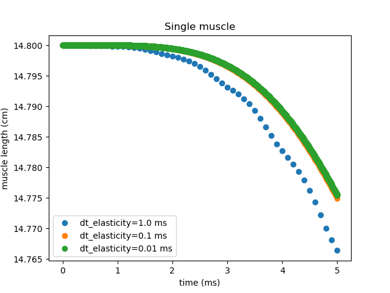
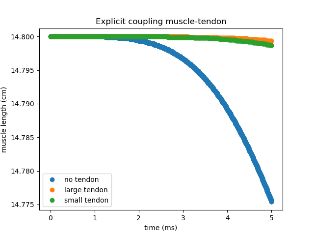
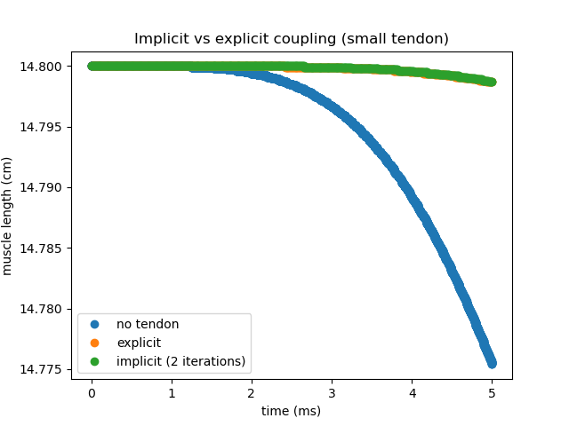

# Comparison of a single muscle with a muscle-tendon system 

## Single muscle 

This is the case setup we consider a muscle which is fixed to a wall on one end and free on the other one. The muscle is contracted due to the input from `/MU_firing_times_real.txt`. First of all, we start by studying the effect of different `dt_elasticity`. 



## Muscle-Tendon

At the free end of the muscle we add a tendon. The tendon is attached to the muscle on one end and is free on the other side. We expect the tendon to move as the muscle contracts. Since the tendon is adding to the mass that must be accelerated, it is expected to see that the muscle contracts less when the tendon is attached. 

### Explicit coupling

We use the following scheme

```
<coupling-scheme:serial-explicit>
  <participants second="TendonSolver" first="MuscleSolverLeft"/>
  <max-time value="5.0"/>           
  <time-window-size value="0.01"/>   
  <exchange data="Displacement"    mesh="TendonMeshLeft"    from="TendonSolver" to="MuscleSolverLeft"/>
  <exchange data="Velocity"    mesh="TendonMeshLeft"    from="TendonSolver" to="MuscleSolverLeft"/>
  <exchange data="Traction"        mesh="MuscleMeshLeft" from="MuscleSolverLeft" to="TendonSolver"/>  
</coupling-scheme:serial-explicit>  
```

and study the effect of the additional tendon mass:

- small tendon

```
tendon_extent = [3.0, 3.0, 4.0] # [cm, cm, cm]
tendon_offset = [0.0, 0.0, muscle1_extent[2]]
n_elements_tendon = [2, 2, 8] 
```

- large tendon

```
tendon_extent = [3.0, 3.0, 2.0] # [cm, cm, cm]
tendon_offset = [0.0, 0.0, muscle1_extent[2]]
n_elements_tendon = [2, 2, 4] 
```



### Implicit

> **Note**
> In order to use implicit coupling we have to make sure that the checkpoints are loaded correctly. In particular, it's necessary to load checkpoints for the fastmonodomainsolver, not only for the mechanics solver. An easy way to check weather the checkpoints are loaded correctly for the fibers, is to set `"outputOnlyConvergedTimeSteps": False` and check that the results in `muscle1_fibers*.vtu` do not change for every iteration. 


