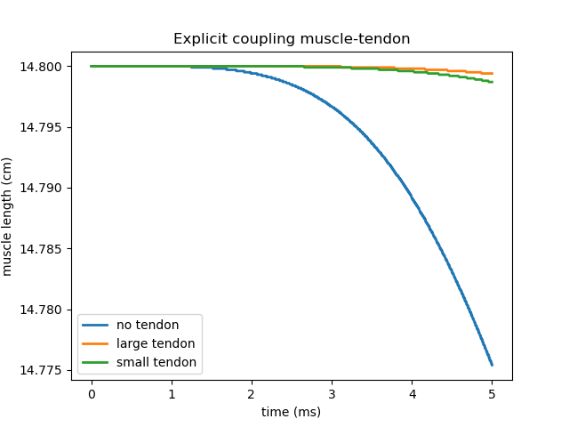
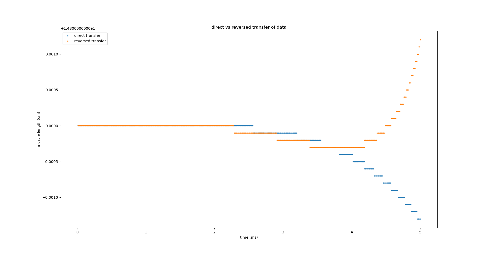

# Comparison of a single muscle with a muscle-tendon system 

## Single muscle 

To run this case open a terminal and type
```
./muscle ../settings_single_muscle
```

This is the case setup we consider a muscle which is fixed to a wall on one end and free on the other one. The muscle is contracted due to the input from `/MU_firing_times_real.txt`. First of all, we start by studying the effect of different `dt_elasticity`. 


## Muscle-Tendon

At the free end of the muscle we add a tendon. The tendon is attached to the muscle on one end and is free on the other side. We expect the tendon to move as the muscle contracts. Since the tendon is adding to the mass that must be accelerated, it is expected to see that the muscle contracts less when the tendon is attached. 

To run this case open two terminals and type
```
./muscle_precice ../settings_muscle
```
and 
```
./tendon_precice ../settings_tendon.py
```

### Explicit coupling

We use the following scheme

```
<coupling-scheme:serial-explicit>
  <participants second="TendonSolver" first="MuscleSolverLeft"/>
  <max-time value="5.0"/>           
  <time-window-size value="0.01"/>   
  <exchange data="Displacement"    mesh="TendonMeshLeft"    from="TendonSolver" to="MuscleSolverLeft"/>
  <exchange data="Velocity"    mesh="TendonMeshLeft"    from="TendonSolver" to="MuscleSolverLeft"/>
  <exchange data="Traction"        mesh="MuscleMeshLeft" from="MuscleSolverLeft" to="TendonSolver"/>  
</coupling-scheme:serial-explicit>  
```

and study the effect of the additional tendon mass:

- small tendon

```
tendon_extent = [3.0, 3.0, 4.0] # [cm, cm, cm]
tendon_offset = [0.0, 0.0, muscle1_extent[2]]
n_elements_tendon = [2, 2, 8] 
```

- large tendon

```
tendon_extent = [3.0, 3.0, 2.0] # [cm, cm, cm]
tendon_offset = [0.0, 0.0, muscle1_extent[2]]
n_elements_tendon = [2, 2, 4] 
```



### Implicit

> **Note**
> In order to use implicit coupling we have to make sure that the checkpoints are loaded correctly. In particular, it's necessary to load checkpoints for the fastmonodomainsolver, not only for the mechanics solver. An easy way to check weather the checkpoints are loaded correctly for the fibers, is to set `"outputOnlyConvergedTimeSteps": False` and check that the results in `muscle1_fibers*.vtu` do not change for every iteration. 


The next plot compares the results using different criteria for the implicit scheme. We consider cases where we do a constant number of iterations per timestep, vs cases where we set a convergence criterium based on the data. In the second case, is necessary to add an acceleration scheme. 


Note that *implicit* corresponds to the following
```
<acceleration:IQN-ILS>
  <data name="Displacement" mesh="TendonMeshLeft"/>
  <data name="Velocity" mesh="TendonMeshLeft"/>
  <data name="Traction" mesh="MuscleMeshLeft"/>
  <preconditioner type="residual-sum"/>
  <filter type="QR2" limit="1e-3"/>
  <initial-relaxation value="0.6"/>
  <max-used-iterations value="15"/>
  <time-windows-reused value="15"/>
</acceleration:IQN-ILS>

<max-iterations value="100"/>

<relative-convergence-measure limit="1e-5" data="Displacement" mesh="TendonMeshLeft" strict="1"/>
<relative-convergence-measure limit="1e-5" data="Velocity" mesh="TendonMeshLeft" strict="1"/>
<absolute-convergence-measure limit="1e-2" data="Traction" mesh="MuscleMeshLeft" strict="1"/>
```

If we look at the total number of iterations, *implicit* required 1393 iterations, which is notably less than for *implicit (4 iterations)*, where 4x499=1996 and yet the convergence measurements where not satisfied.

We did a parameter study for *implicit*:

|  `initial-relaxation value` |  # total iterations |  
|---|---|
| 0.5  | 1317  |   
| 0.6  |  1393 |   
| 0.7  |  1444 |   
| 0.8  |  1274 |   

### Proper tuning of the acceleration when using an implicit scheme

A sensible tuning is such that `max-used-iterations value`> `max-iterations value` and that  `max-used-iterations value`> `time-windows-reused value`. Now we consider the following acceleration schemes:

- Settings for *implicit (case 2)*

```
<acceleration:IQN-ILS>
  <data name="Displacement" mesh="TendonMeshLeft"/>
  <data name="Velocity" mesh="TendonMeshLeft"/>
  <data name="Traction" mesh="MuscleMeshLeft"/>
  <preconditioner type="residual-sum"/>
  <filter type="QR2" limit="1e-2"/>
  <initial-relaxation value="0.4"/>
  <max-used-iterations value="100"/>
  <time-windows-reused value="15"/>
</acceleration:IQN-ILS>

<max-iterations value="25"/>

<relative-convergence-measure limit="1e-5" data="Displacement" mesh="TendonMeshLeft" strict="0"/>
<relative-convergence-measure limit="1e-5" data="Velocity" mesh="TendonMeshLeft" strict="0"/>
<absolute-convergence-measure limit="1e-2" data="Traction" mesh="MuscleMeshLeft" strict="0"/>
```

- Settings for *implicit (case 3)*

As in *case 2* but now  `initial-relaxation value="0.6"`.

- Settings for *implicit (case 4)*

As in *case 2* but now  `initial-relaxation value="0.9"`.

We can compare the results in the next image. *case 4* is not shown, but it mostly overlaps with *case 3*. 


To see what the acceleration is doing look into the `precice-TendonSolver-iterations.log`. To understand the meaning of each column you can read about it in the [precice documentation](https://precice.org/running-output-files.html#precice-mysolver-iterationslog). The table below shows some of the key information obtained from this file. 


| case number|  `initial-relaxation value` |  # total iterations |  non-converged steps |
|---|---|---|----|
| 2  | 0.4  | 1283  | 9 |
| 3  |  0.6 |   1305 | 6 |
| 4  |  0.9 |   1310 | 4 |

### Length of the tendon

The length of the tendon remains constant as you can see in the next plot:


### Reversed transfer of data

A main advantage of using an implicit coupling scheme is that we should be able to tranfer data in the non-implicit direction as well. In other words:

```
<exchange data="Traction" mesh="TendonMeshLeft" from="TendonSolver" to="MuscleSolverLeft"/>  
<exchange data="Displacement" mesh="MuscleMeshLeft" from="MuscleSolverLeft" to="TendonSolver"/>   
<exchange data="Velocity" mesh="MuscleMeshLeft" from="MuscleSolverLeft" to="TendonSolver"/>   
```

To reproduce the reversed transfer of data please change the following in `settings_muscle.py`:
```
"preciceData": [
  {
    "mode":                 "write-displacements-velocities",    
    "preciceMeshName":      "MuscleMeshLeft",              
    "displacementsName":    "Displacement",                    
    "velocitiesName":       "Velocity",                     

  },
  {
    "mode":                 "read-traction",                   
    "preciceMeshName":      "MuscleMeshLeft",               
    "tractionName":         "Traction",                       
  }
],
    
```

and the next lines in `setttings_tendon.py`:

```
      "preciceData": [  
        {
          "mode":                 "read-displacements-velocities", "write-displacements-velocities", "write-traction"
          "preciceMeshName":      "TendonMeshLeft",                    
          "displacementsName":    "Displacement",                    
          "velocitiesName":       "Velocity",                     

        },
        {
          "mode":                 "write-traction",                   
          "preciceMeshName":      "TendonMeshLeft",                    
          "tractionName":         "Traction",                         
      ],
    
```

We are trying out the following scheme for *case 5*:
```
<acceleration:IQN-ILS>
  <data name="Displacement" mesh="MuscleMeshLeft"/>
  <data name="Velocity" mesh="MuscleMeshLeft"/>
  <data name="Traction" mesh="TendonMeshLeft"/>
  <preconditioner type="residual-sum"/>
  <filter type="QR2" limit="1e-2"/>
  <initial-relaxation value="0.9"/>
  <max-used-iterations value="40"/>
  <time-windows-reused value="15"/>
</acceleration:IQN-ILS>


<max-iterations value="25"/>
```

We investigate how this compares to *case 4*. 

| case number|  `max-used-iterations value` |  # total iterations |  non-converged steps | max(QNColumns)
|---|---|---|---|---|
| 4  |  100 | 1310 | 4 | 23 |
| 5  | 40 | 3302 | 4 | 40 |

We can see that the number of *QNColumns* was very low in *case 4* and no columns where deleted due to  `max-used-iterations value`. In fact, no columns would have been deleted even if we used `max-used-iterations value = 40`, meaning that both cases are directly comparable. 



Nevertheless, the plot shows an unexpected behaviour that still needs to be investigated. 

## Muscle-Tendon-Muscle

Now we add a muscle to the free end of the tendon. The added muscle will be fix to the wall. It will be a dummy muscle (no activation, just an hyperelastic material with different material properties than the tendon). We want to see how the added muscle elongates as the first muscle contracts.

To run this case open three terminals and type
```
./muscle_precice ../settings_muscle.py
```
and 
```
./tendon_precice ../settings_tendon_between_muscles.py
```
and
```
./muscle_precice_mechanics ../settings_right_muscle.py
```

In order for this to work, you must change one line in `settings_muscle.py` and call the precice configuration file for the 3-participants case:

```
    "preciceConfigFilename":    "../precice_config_multi_coupling.xml",    # the preCICE configuration file

```

In the following image you can see the results of the simulation. The image shows the expected behaviour but then the simulation crashed for reasons that are still being investigated.


