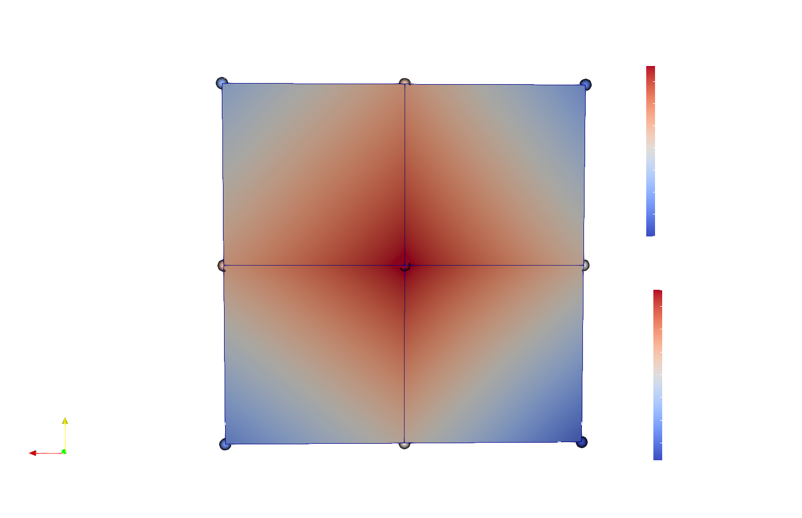
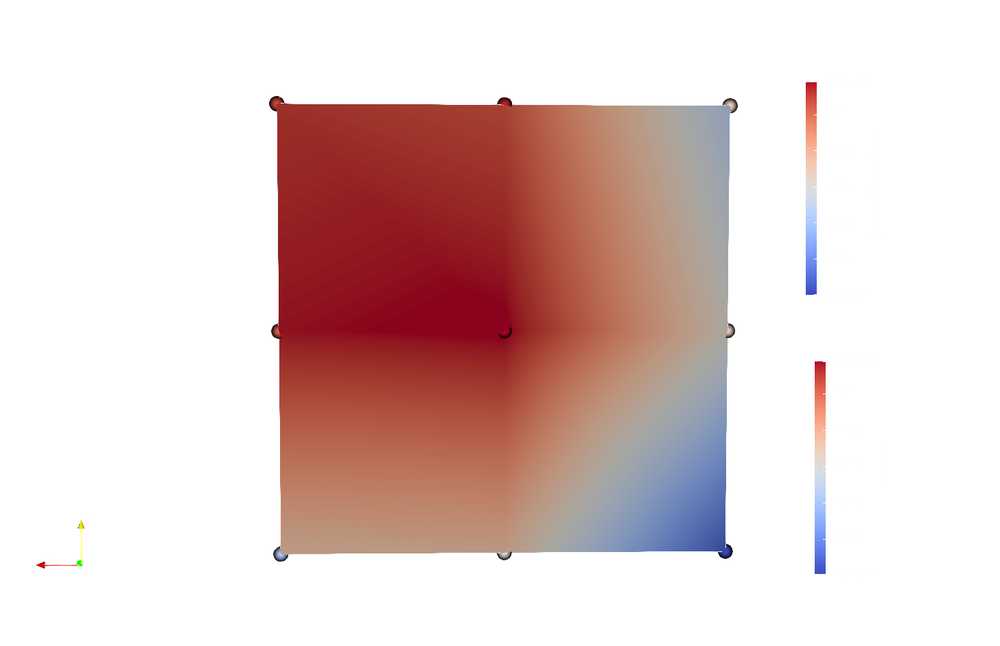

# Coupling a muscle with a quasistatic tendon

The goal of this case is to debug the use of a tendon quasistatic solver for coupling purposes. The goal is to get matching traction values at the interface, eg. get implicit coupling to converge. 

## How to build and run

To build the muscle and quasistatic tendon solvers:
```
cd muscle_quasistatictendon/
mkorn && sr
cd build_release
```

You will need two terminals to run the example. In the first terminal execute
```
cd muscle_tendon/build_release
./muscle_neuromuscular.cpp ../settings_muscle.py
```

and in the second one run
```
cd muscle_tendon/build_release
./tendon_quasistatic.cpp ../settings_tendon.py
```

Alternatively you can choose a linear quasistatic solver for the tendon
```
cd muscle_tendon/build_release
./tendon_quasistatic.cpp ../settings_tendon.py
```

## Discussion of results (EXPLICIT)

Assume `n_elements_muscle1 = [2, 2, 20]` and `n_elements_tendon = [2, 2, 4]`

- linear_quasistatic with `dt=0.01`:
Not looking good. The corners (xmax, 0) and (0, ymax) are off. But maybe a absolute convergence of 1e-2 could still be satisfied. 

- quasistatic with `dt=0.01`:
**Works properly** :tada:
Even the corner values match! The image below corresponds to t=10ms, when the muscle is contracted. The image shows the values provided by precice, that is, our boundary condition and the actual traction field in the tendon.




## Discussion of results (IMPLICIT)

> **Warning**
> Results are not looking good. Are we doing the iterations properly?
> - When trying to do quasinewton: ERROR: The quasi-Newton update contains NaN values. This means that the quasi-Newton acceleration failed to converge. When writing your own adapter this could indicate that you give wrong information to preCICE, such as identical data in succeeding iterations. Or you do not properly save and reload checkpoints. If you give the correct data this could also mean that the coupled problem is too hard to solve.

- **zero attempt**:
implicit coupling with one iteration (for comparison to explicit coupling)

```
<max-iterations value="1" />
<absolute-convergence-measure limit="1e-6" data="Displacement" mesh="TendonMeshLeft" strict="0"/>
<absolute-convergence-measure limit="1e-2" data="Traction" mesh="MuscleMeshLeft" strict="0"/>
```

Precice provides 0 values for the traction!


- **first attempt**: 
We apply an absolute convergence criterium.

```
<max-iterations value="10" />
<absolute-convergence-measure limit="1e-6" data="Displacement" mesh="TendonMeshLeft" strict="1"/>
<absolute-convergence-measure limit="1e-2" data="Traction" mesh="MuscleMeshLeft" strict="1"/>
```



- **second attempt**:
The motivation is to have an stricter criteria for convergence.

```
<max-iterations value="50" />
<relative-convergence-measure limit="1e-4" data="Displacement" mesh="TendonMeshLeft" strict="1"/>
<relative-convergence-measure limit="1e-2" data="Traction" mesh="MuscleMeshLeft" strict="1"/>
```

Acceleration is necessary in this case. In particular I use

```
<acceleration:aitken>
    <data name="Traction" mesh="MuscleMeshLeft"/>
    <initial-relaxation value="0.1"/>
</acceleration:aitken> 
```

I observed that using 

```
<acceleration:constant>
    <relaxation value="0.5"/>
</acceleration:constant>
```

leads to a worse performance that not using acceleration at all. 


TODO: **try larger timestep `dt=0.1`**