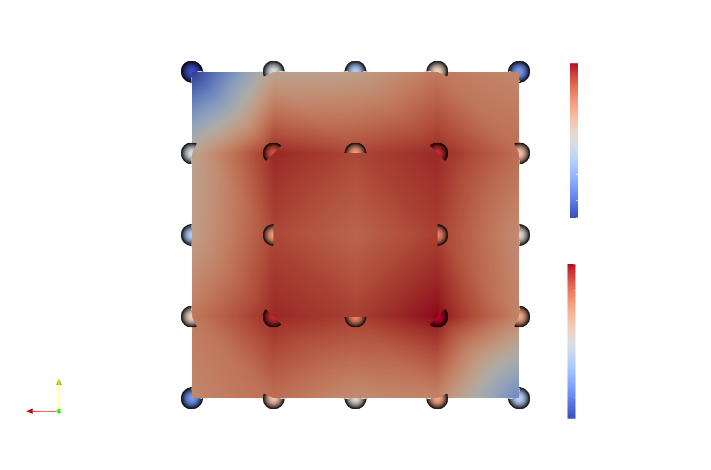
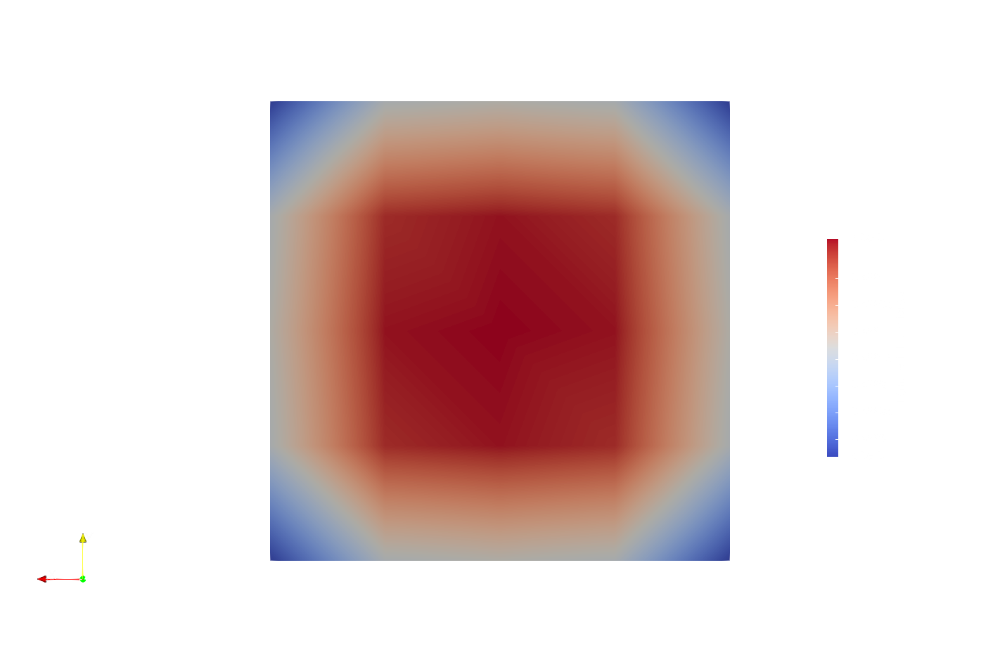
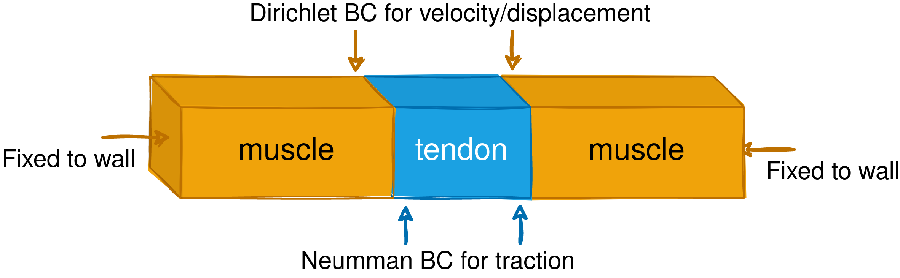

# Surface Coupling Examples

This folder contains examples were muscles and tendons are coupled using preCICE, a coupling library for partitioned multi-physics simulations. 
PreCICE does not provide an official adapter for OpenDiHu (yet). Benjamin Maier developed an opendihu precice adapter which is included in the opendihu source code. The existing opendihu consists of two independent adapters; one for surface coupling and another one for volume coupling.  

The examples in this folder use the built-in opendihu precice adapter for surface coupling.

## The muscle participant:

**A multi-scale problem**

The muscle participant requires of the solution of a multi-scale problem consisting of three main phenomena:
* sub-cellular processes at the sarcomeres: modelled as a 0D process and with `dt_0D = 0.5e-3` [ms]                      
* potential propagation at the fibers: modelled as a 1D process and with `dt_1D = 1e-3` [ms] 
* solid-mechanics (muscle contraction): modelled as a 3D process and with `dt_elasticity = 1e-1` [ms] 

**About muscle fibers**

The muscle fibers are created in `helper.py`.  All fibers have the same length (equal to the muscle length) and direction (given by z-axis). In the `variables.py` we can specify:
- numer of points per fiber (eg. number of sarcomeres per fiber): `n_points_whole_fiber`
- number of fibers in the x and y axis: `n_fibers_x` and `n_fibers_y`
- fiber distribution file: use input file `/MU_fibre_distribution_multidomain_67x67_100.txt`

The fibers are stimulated via cortical input. In these examples the neural estimulation is not modelled explicitely and a file with the firing times is used instead. 

- fiber firing times: use input file `"/MU_firing_times_real.txt"`
- alterative fiber firing times (zero everywhere, for no activation): use input file `"/MU_firing_times_real_no_firing.txt"`
- start time for firing: `activation_start_time`

> **Note**
> If you choose not to activate the muscle fibers the muscle will not contract unless you apply an external force. If you try this in the muscle-tendon example you will see that both the muscle and the tendon remain unmodified.

**About the subcellullar processes**

We are using the Hodgkin-Huxley-Razumova model. 

If you want to change the used cellml model you need to do the following:
- select another file for `cellml_file`
- provide the required parameters in `muscle_material_parameters`
- modify `Ǹ_states` and `Ǹ_algebraics` in `muscle_neuromuscular.cpp` according to the model
- fill-in slots for mapping purposes in `helper.py`

> **Warning**
> Changing the subcellular model typically requires recompiling the muscle solver.


**The structure of the muscle solver**

The opendihu solver that is used for the muscle participant is given by `muscle_neuromuscular.cpp`.

The muscle solver consists of the `MonodomainSolver`, which models the 1d voltage propagation in the muscle fibers, and the `MuscleContractionSolver`, which models the 3d solid mechanics. 

The idea behind the `MonodomainSolver` is to apply strang splitting to each fiber. The components of the Strang splitting are the fiber reaction term and the fiber diffusion term. The fiber reaction term corresponds to the sub-cellular processes taking place at the sarcomeres. 


All in all, we have:

- muscle solver
    - MonodomainSolver (strang splitting)
        - reaction term
        - diffusion term
    - MuscleContractionSolver

> **Note**
> The overall timestep of the strang splitting is `dt_splitting_0D1D = dt_1D`
> The optimal choice of timesteps for the strang splitting is `dt_1D = 2*dt_0D`

**About transfer of data in opendihu coupling**

The transfer of data between the opendihu solvers is done via the slots feature. We can refer to the slots via name or their position index. In the case of this muscle solver we need transfer of data between
- Reaction and diffusion term in the strang splitting
- Monodomainsolver and muscleContractionSolver

Let's first look at the transfer of data in the strang splitting: 

This is what we have specified in `settings_muscle.py`:
```
"connectedSlotsTerm1To2": [0],   
"connectedSlotsTerm2To1": [0],  

```
Meaning that the slot 0 is transferred from term 1 (reaction term) to the term 2 (diffusion) and back.

The immediate question is what is stored in that slot. For this we need to refer to `muscle1_mappings`, which are defined in `helper.py` and depend on the specified `cellml_file`.

```
  variables.muscle1_mappings = {
    ("parameter", 0):           "membrane/i_Stim",          # parameter 0 is I_stim
    ("parameter", 1):           "Razumova/l_hs",            # parameter 1 is fiber stretch λ
    ("connectorSlot", "m1vm"):  "membrane/V",               # expose Vm to the operator splitting
    ("connectorSlot", "m1gout"):"Razumova/activestress",
    ("connectorSlot", "m1alp"): "Razumova/activation",      # expose activation 
    ("connectorSlot", "m1lda"): "Razumova/l_hs",            # fiber stretch λ
  }
```
The naming of the variables is given by the `cellml_file`.

> **Note**
> *cellml* files can be visualize (and run!) with the open-source software *OpenCOR*.


Regarding the Monodomainsolver and the muscleContractionSolver coupling, the mechanics solver `MuscleSolverContraction` recives the following data:

```
"slotNames": ["m1lda", "m1ldot", "m1g_in", "m1T", "m1ux", "m1uy", "m1uz"]
# slot names of the data connector slots: lambda, lambdaDot, gamma, traction
```

You may notice `"mg_in"` is not defined in the `muscle1_mappings`, but in the settings file we have defined a mapping from :

```
"connectedSlots": [
("m1gout", "m1g_in")     # "Razumova/activestress" from CellML to Muscle contaction solver

]
```

It can be the case that we provide slots that are not connected. Naming unconnected slots does not make a difference, thus it makes no sense to do so. We can easily check which slots are connected by looking at `solver_structure.txt` which is generated with the building of the solver. 

TODO: Benjamin says that "just" naming slots makes no difference, but I did see differences. Try again to confirm it!

**Meshes and spatial discretization**

On the one hand we have a 1D mesh for each fiber. On the other hand we have a 3D mesh for the solid mechanics problem. The dimensions and numer of elements are defined by `muscle1_extent` ([cm]) and `n_elements_muscle1`.

The spatial discretization for the solid mechanics is done via FEM. In OpenDiHu we can choose between using linear or quadratic ansatz functions. Quadratic ansatz functions are used for the muscle participant. This is implemented by choosing `"meshName": "muscle1Mesh_quadratic"` in the muscle settings file. 

> **Note**
> Quadratic elements are created by taking 2x2x2 linear elements. Thus `n_elements_muscle1` must contain even numbers.

TODO: check that defining `"muscle1Mesh"` is actually necessary.


## The tendon participant:
Two opendihu solvers for the tendon participant can be found in this folder: `tendon_precice_dynamic.cpp` and `tendon_linear_precice_dynamic.cpp`. The main difference is that the equation describing the solid mechanics used on each of them is different. I recommend using `tendon_linear_precice_dynamic.cpp`, which solves a linear equation and is believed to be more stable. 

In any case, you must specify the `tendon_material` according to the opendihu solver you are using:

- linear tendon: `tendon_linear_precice_dynamic.cpp` and `tendon_material= "SaintVenantKirchoff"` 
- non-linear tendon: `tendon_precice_dynamic.cpp` and `tendon_material= "SaintVenantKirchoff"` 

In the file `settings_tendon.py` you can see the input parameters that are used in each case. You can play with the elasticity of the tendon by modifying these parameters. 

> **Note**
> If we solve a linear equation does it makes sense to use quadratic ansatz functions?? TODO: make sure that linear functions work well for a single tendon. 


## About the muscle-tendon example:

**How to build and run**

To build the muscle and tendon solvers:
```
cd muscle_tendon/
mkorn && sr
cd build_release
```

You will need two terminals to run the example. In the first terminal execute
```
cd muscle_tendon/build_release
./muscle_neuromuscular.cpp ../settings_muscle.py
```

and in the second one run
```
cd muscle_tendon/build_release
./tendon_linear.cpp ../settings_tendon.py
```

> **Note**
> To obtain a more detailed logging output (eg. to debug precice) it's convenient to build using debug mode. In that case run `mkorn && sd` and run the code in the `build_debug/` folder.


**Set-up**
- muscle: fixed on one end (z=0.0) and attached to the tendon in the other end (z= muscle initial length)
- tendon: fixed on one end (z= muscle initial length + tendon length) and attached to the muscle on the other end (z= muscle initial length)
- the spatial discretization of the muscle and tendon is chosen so that we have a matching mesh (we define same number of elements on the x and y direction)
- transfer of data: the tendon sends the displacement and velocities to the muscle and the muscle sends traction data to the tendon.
- `</coupling-scheme:serial-explicit>`

**How to visualize**

The visualization can be done with *ParaView*.
Interesting group files to visualize:
- muscle1_contraction_..vtp
- muscle1_fibers_..vtp (use Points Gaussian)
- mechanics_3D_..vtp (tendon results)

To debug precice, you can also visualize the files in the folder `preCICE-output/`.



> **Warning**
> The traction values at the edges of the coupling interface are wrong. I believe this issue has nothing to do with the precice adapter but on how opendihu applies neumann boundary conditions. 
> **Priority:** fix issue with Neumann boundary condition in a single tendon first!


**WIP: solve traction BC bug**

The MuscleContractionSolver has a dynamic and a static mode. 
If `"dynamic: True"` we are in dynamic mode and we call the `"DynamicHyperelasticitySolver"` whereas if `"dynamic: False"` we call the `"HyperelasticitySolver"`.  

So far, I have been using the dynamic MuscleContractionSolver, but I believe I must switch too the static MuscleContractionSolver. In the dynamic solver the traction boundary condition does not match the traction field but it does so in the static solver. We need the traction boundary condition too match the traction field in our coupling scenario. 

> BM: Because it is a dynamic problem, the nodes at the Neumann BC domain accelerate slowly, counteracting inertia. Also the stress >builds up slowly. The unknowns of the problem that is solved are the displacement u and velocity v (and pressure p if incompressible). From the solution u, we can compute the stress tensor S by a formula and the traction by S n. The traction that we see in ParaView is computed like this. It is zero at t=0, because S=0. The traction in the output is not directly linked to the Neumann BC as it would be in a static problem.

**TODO:** Use `cubic_muscle_only_monodomain_and_contraction/` to debug using a static solver. After several timesteps I get warnings about det J < 0. So far I have tried:
- smaller load factors
- smaller timestep (down to `dt_elasticity=1e-2`)
- higher mesh resolution
- adding regularisation:`"regularization": [1e-5,1e-3]`
- increasing frequency to rebuild jacobian

Of course it could be my changes were not significant enough or that I had to combine several of them. The question is if it makes sense to try or this is an ill-posed problem. 

*some more issues:*

- Implicit coupling does not converge (maximum number of iterations (eg. 100) is reached) 
- As a consequence of the previous point we cannot have running simulations where the traction is sent from the tendon to the muscle.
- If we replace the free end of the tendon by a traction bc this boundary condition is not reflected in the results. However, a single tendon with different traction boundary conditions at the ends was simulated without issues.
- weird issue: the geometryValues in `10_function_space_field_variable.tpp` look weird, I always have 2x2x2 regardless the number of elements. If the elements are 2*n, then tendon_extend/n.
- This is what happens if we apply constant Traction_z = -0.5 in a tendon. TODO: find static solver for tendon given a time-stepping scheme.


## About the muscle-tendon-muscle example:

**How to build and run**

To build the muscle and tendon solvers:
```
cd muscle_tendon/
mkorn && sr
cd build_release
```

You will need three terminals to run the example. In the first one execute
```
cd muscle_tendon_muscle/build_release
./muscle_neuromuscular.cpp ../settings_muscle.py
```

and in the second terminal run
```
cd muscle_tendon_muscle/build_release
./tendon_linear.cpp ../settings_tendon.py
```
and in the third one run
```
cd muscle_tendon_muscle/build_release
./muscle_neuromuscular.cpp ../settings_muscle_right.py
```


**Set-up**



- Muscle left and muscle right are identical except for their location on the z axis. The two muscles are connected by a tendon.
- muscle left: fixed on one end (z=0.0) and attached to the tendon in the other end (z= muscle initial length)
- tendon: attached to muscle 2 (z= muscle initial length + tendon length) and attached to the muscle 1 on the other end (z= muscle initial length)
- muscle right: fixed on one end (z= 2* muscle initial length + tendon length) and attached to the tendon in the other end (muscle initial length + tendon length)
- the spatial discretization of the muscles and tendon is chosen so that we have a matching mesh (we define same number of elements on the x and y direction)
- transfer of data: the tendon sends displacements and velocities to the muscle and both muscles send tractions to the tendon.
- coupling scheme: 
    -   multi-coupling (this uses a combination of parallel-implicit in practice)
    -   combination of two `</coupling-scheme:serial-explicit>`


**Open Issues**
* When only the left muscle is activated:
    * the interface between the left muscle and the tendon does not move, meaning that the tendon and the right muscle remain unmodified.
* When both muscles are activated:
    * the tendon is displaced to the right. It looks like we have introduced some artificial unsimmetry to the problem. Changing the order in the xml configuration file does not change the result.
    * Using multi-coupling instead of the combination of two explicit results in the tendon being further displaced to the right. 
