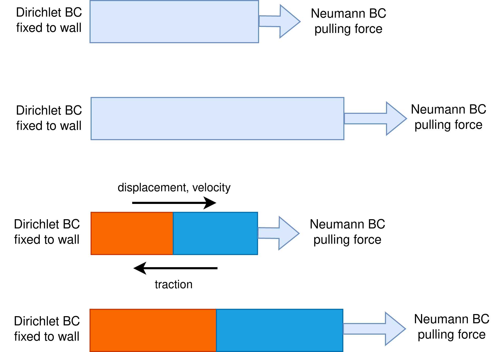
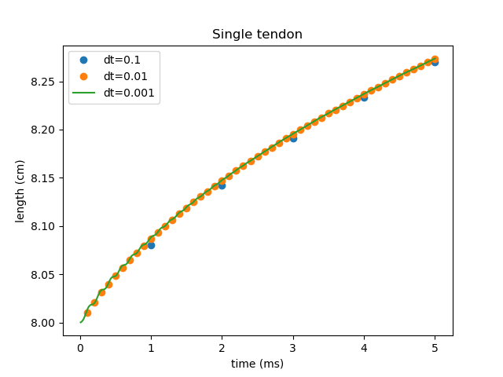
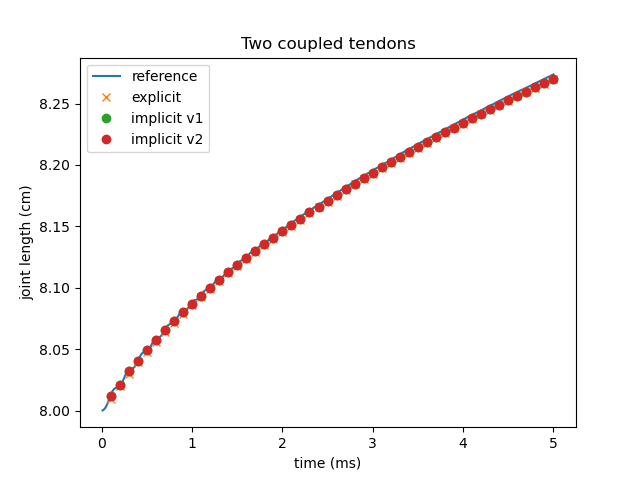

# Comparison of a single tendon and two coupled tendons

This is the case setup we consider a tendon which is fixed to a wall on one side and pull by a lineraly increasing force on the other side. Then we split the tendon in two and use the precice surface adapter to couple them. 



You can run the single tendon
```
./tendon ../single_tendon.py
```

or the coupled version
- terminal 1
```
./tendon ../left_tendon.py
```
- terminal 2
```
./tendon ../right_tendon.py
```

First of all we run the single tendon using different timesteps:



Then we compare this with the coupled case. Based on the previous image, we use `dt_elasticity  = 0.01`. 
- Explicit
```
<coupling-scheme:serial-explicit>
    <participants first="LeftTendonSolver" second="RightTendonSolver"/>
    <max-time value="5.0"/>           
    <time-window-size value="0.01"/>   
    <exchange data="Displacement"    mesh="LeftTendonMesh"    from="LeftTendonSolver" to="RightTendonSolver"/>
    <exchange data="Velocity"    mesh="LeftTendonMesh"    from="LeftTendonSolver" to="RightTendonSolver"/>
    <exchange data="Traction"        mesh="RightTendonMesh" from="RightTendonSolver" to="LeftTendonSolver"/>  
</coupling-scheme:serial-explicit> 
```
- implicit v1 
```
<coupling-scheme:parallel-implicit>
      <participants first="RightTendonSolver" second="LeftTendonSolver"/>

      <max-time value="5.0"/>           
      <time-window-size value="0.01"/>   

      <exchange data="Displacement" mesh="LeftTendonMesh" from="LeftTendonSolver" to="RightTendonSolver"/>  
      <exchange data="Velocity" mesh="LeftTendonMesh" from="LeftTendonSolver" to="RightTendonSolver"/>  
      <exchange data="Traction" mesh="RightTendonMesh" from="RightTendonSolver" to="LeftTendonSolver"/>   

      <acceleration:IQN-ILS>
        <data name="Displacement" mesh="LeftTendonMesh"/>
        <data name="Velocity" mesh="LeftTendonMesh"/>
        <data name="Traction" mesh="RightTendonMesh"/>
        <preconditioner type="residual-sum"/>
        <filter type="QR2" limit="1e-3"/>
        <initial-relaxation value="0.6"/>
        <max-used-iterations value="10"/>
        <time-windows-reused value="15"/>
      </acceleration:IQN-ILS>

      <max-iterations value="50"/>

      <relative-convergence-measure limit="1e-4" data="Displacement" mesh="LeftTendonMesh" strict="1"/>
      <relative-convergence-measure limit="1e-4" data="Velocity" mesh="LeftTendonMesh" strict="1"/>
      <absolute-convergence-measure limit="0.1" data="Traction" mesh="RightTendonMesh" strict="1"/>


    </coupling-scheme:parallel-implicit>
```
- implicit v2
```
<coupling-scheme:parallel-implicit>
      <participants first="RightTendonSolver" second="LeftTendonSolver"/>

      <max-time value="5.0"/>           
      <time-window-size value="0.01"/>   

      <exchange data="Displacement" mesh="LeftTendonMesh" from="LeftTendonSolver" to="RightTendonSolver"/>  
      <exchange data="Velocity" mesh="LeftTendonMesh" from="LeftTendonSolver" to="RightTendonSolver"/>  
      <exchange data="Traction" mesh="RightTendonMesh" from="RightTendonSolver" to="LeftTendonSolver"/>   

      <acceleration:IQN-ILS>
        <data name="Displacement" mesh="LeftTendonMesh"/>
        <data name="Velocity" mesh="LeftTendonMesh"/>
        <data name="Traction" mesh="RightTendonMesh"/>
        <preconditioner type="residual-sum"/>
        <filter type="QR2" limit="1e-3"/>
        <initial-relaxation value="0.6"/>
        <max-used-iterations value="10"/>
        <time-windows-reused value="15"/>
      </acceleration:IQN-ILS>

      <max-iterations value="50"/>

      <relative-convergence-measure limit="1e-6" data="Displacement" mesh="LeftTendonMesh" strict="1"/>
      <relative-convergence-measure limit="1e-6" data="Velocity" mesh="LeftTendonMesh" strict="1"/>
      <absolute-convergence-measure limit="0.1" data="Traction" mesh="RightTendonMesh" strict="1"/>


    </coupling-scheme:parallel-implicit>

```

Note that when we look at the absolute convergence measure for the traction for v1 and v2 we have a two-norm difference of 10^(-2) or 10^(-4). We have also reached values of 10^(-6), but no improvement with respect to implicit v2 is visible. 



**The image shows how numerical errors accumulate resulting in a lower overall elongation of the tendons compared to the single tendon reference. The existance of numerical errors is expected and cannot be overcome by using more restrictive convergence criterium for the implicit schemes.**

This figures can be obtained by running `python plot.py`. The length values where obtained with the function `write_to_file`, that averages de the z-coordinate vales of all points at the extreme of the tendon.

> **Note**
> - At t=0.0 we have a pulling force of 0.05, which is increased linearly. If instead we start with a force of 0.0, then we have an error warning saying *"WARNING: The coupling residual equals almost zero. There is maybe something wrong in your adapter. Maybe you always write the same data or you call advance without providing new data first or you do not use available read data. Or you just converge much further than actually necessary."*
> - we have not put an stricter criterium for the traction because otherwhise a very high number of iterations is needed for t=0.0 and yet after that it doesn't bring much. 
