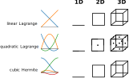

Mesh
=======

Meshes appear in the C++ code. A ``Mesh`` together with a ``BasisFunction`` define a ``FunctionSpace``. In the python settings, there are no function spaces, the *mesh* is everything that needs to be specified.

C++ class template Mesh
-------------------------

On the C++ side, there exist three mesh types, 

* ``Mesh::StructuredRegularFixedOfDimension<D>``,
* ``Mesh::StructuredDeformableOfDimension<D>``,
* ``Mesh::UnstructuredDeformableOfDimension<D>``,

with ``D`` equals to 1, 2 or 3.

Additionally, there is a composite mesh,

* ``Mesh::CompositeOfDimension<D>``,

which forms a single mesh that consists of multiple meshes of type ``Mesh::StructuredDeformableOfDimension<D>``. 

:numref:`meshes` shows the different mesh types for linear and quadratic basis functions. As can be seen, the meshes all have quadrilateral elements, corresponding to lines in 1D, quadrilaterals in 2D and hexaeders in 3D.

.. _meshes:
.. figure:: images/meshes.svg
  :width: 50%

  Different Mesh types, here 2D meshes, for linear or Hermite basis functions (left column) and for quadratic Lagrange basis functions (right column)

The **Structured Regular Fixed** mesh is a structured rectilinear mesh with a fixed mesh width. The mesh width is the same in all dimensions. 
A StructuredRegularFixed mesh is fully defined by the number of elements in each coordinate direction and the mesh width.
The geometry of a mesh of this type cannot be changed during the computation, that means it is not possible to use this mesh for computing deformations.

One advantage of this mesh type is that the needed memory is independent of the number of elements and nodes, because only the mesh width and dimensions need to be stored. Therefore it is suited for large problem sizes.
A second advantage is that mass and stiffness matrices do not need to be integrated numerically if linear Lagrange basis functions are used. These matrices are instead assembled from precomputed stencils.

The **Structured Deformable** mesh is more general than the *Structured Regular Fixed* mesh. The node positions can have arbitrary locations.
However, the mesh is still structured, i.e. it has a fixed number of elements in the coordinate directions.

When computing elasticity problems, the geometry of the mesh (node positions) can change, i.e. the mesh can deform. 

This mesh type is the one most commonly used, when a given geometry should be discretized. For these two *structured* mesh types, the domain decomposition always uses planar cuts to subdivide the whole mesh into subdomains. Therefore, a subdomain again has always a fixed number of elements in each coordinate direction.

The **Unstructured** mesh is the most general mesh type. Contrary to the structured meshes, here the adjacency information can be defined arbitrarily and is not implicitely given by the mesh structured. 
The node positions need to be specified and can move during the computation, like with the *Structured Deformable* mesh.

The *Unstructured* mesh type can only be used with serial execution, i.e. no domain decomposition is implemented.

Node positions are always stored as points in :math:`\mathbb{R}^3`. Consequently, it is possible to define a 1D mesh embedded in the 3D space, for example for 1D muscle fibers in a 3D muscle geometry. Similarly, "bended" 2D meshes can be defined, like the 2D surface of a 3D muscle.

The **Composite** mesh is used when the geometry cannot be described by a single structured mesh because it does not have the shape of a cuboid. Then, 2 or more structured meshes are combined into a single mesh.
   
The number of nodes in a mesh depends on the ansatz functions as visualized in :numref:`mesh_ansatz_functions`.

.. _mesh_ansatz_functions:

  
  1D ansatz functions and resulting elements.
   
A description of the numbering of nodes and degrees of freedom can be found under :doc:`boundary_conditions`.
   
.. _define_meshes:

Python settings for Mesh
---------------------------
   
To specify a mesh in the python settings, depending on the mesh type, its size, node positions or adjacency infos have to be given.

In the python settings, all meshes should be defined at the beginning of the ``config`` dictionary under the ``"Meshes"`` key. 
The item ``"Meshes"`` is itself a dictionary, where the properties of every mesh are contained with a *mesh name* as key. The mesh name can be chosen abitrarily.
It is used to reference the mesh later, where it is needed, e.g. in a FiniteElementMethod object.

.. code-block:: python

  config = {
    "Meshes": {
      "mesh0": {
        "inputMeshIsGlobal": False,
        # further properties of mesh "mesh0" (see below for the description, depending on the type)
      },
      "arbitraryMeshName1": {
         # properties of this mesh
      }
    }
  }

StructuredRegularFixed
^^^^^^^^^^^^^^^^^^^^^^^ 
The **Structured Regular Fixed** mesh is completely specified by the number of elements in each coordinate direction and the physical extent.

.. code-block:: python

  "nElements": [nx, ny],      # example for a 2D mesh
  "physicalExtent": [2.5, 5.0],
  "inputMeshIsGlobal": True,

nElements
~~~~~~~~~~~~
*Default: D=1 (lines): 0, which means a degenerate element, D=2 or D=3: 1*

The number of elements of the mesh in the coordinate directions. For D=1, i.e. lines, it is a scalar non-negative integer value. For D=2 respective D=3 it is a list of 2 respective 3 non-negative integer values.
  
physicalExtent
~~~~~~~~~~~~~~~~
*Default: list of values 1.0*

The "size" of the mesh in physical units (e.g. meters if SI units are used), in the coordinate directions. This has to be a list of ``D``  positive double values.

Because the mesh width has to be constant in all coordinate directions, ``physicalExtent`` has to be a multiple of ``nElements``.

inputMeshIsGlobal
~~~~~~~~~~~~~~~~~~
*Default: ``True``*

Whether the values of ``nElements`` and ``physicalExtent`` describe the global domain (``True``) or the local subdomain (``False``) in parallel execution. See also the notes on :ref:`inputMeshIsGlobal` later.

StructuredDeformable
^^^^^^^^^^^^^^^^^^^^^^^ 
For specifying the **Structured Deformable** mesh there are two possibilities: 

1. Specify ``nElements`` and ``physicalExtent``, like for a *StructuredRegularFixed* mesh. A rectilinear mesh is constructed, analogous to the *StructuredRegularFixed* mesh. There is the additional option ``physicalOffset`` that offsets all node positions by the given vector. The physicalOffset is always global, i.e. even when ``inputMeshIsGlobal`` is set to ``False``, the ``physicalOffset`` specifies the offset to the front lower left corner of the global mesh.

  Note, that now the mesh widths does not need to be the same in every coordinate direction, so there is no restriction on the values of ``nElements`` and ``physicalExtent``.
  Again, the value of ``inputMeshIsGlobal`` applies.
  
  An example is given below:
  
.. code-block:: python

  "nElements": [nx, ny],      # example for a 2D mesh
  "physicalExtent": [2.5, 5.0],
  "physicalOffset": [0.5, 0.0],
  "inputMeshIsGlobal": True,

2. Specify ``nElements`` and the node positions.

.. code-block:: python

  "nElements": [nx, ny],     # example for a 2D mesh
  "nodePositions": [[x,y,z], [x,y,z], ...], 
  "inputMeshIsGlobal": True,

nElements
~~~~~~~~~~~~
*Default: D=1 (lines): 0, which means a degenerate element, D=2 or D=3: 1*

The number of elements of the mesh in the coordinate directions. For D=1, i.e. lines, it is a scalar non-negative integer value. For D=2 respective D=3 it is a list of 2 respective 3 non-negative integer values.
  
nodePositions
~~~~~~~~~~~~~~~
Specify all node positions (all global node positions or all local node positions without ghosts, depending on ``inputMeshIsGlobal``). There are two different formats:

1. A list of points where each point is a list with three entries ``[x,y,z]``. Even for lower dimensional meshes, ``D<3``, the node positions have three components.

  It is possible to define an embedded 1D or 2D manifold in the 3D domain. If this is not needed, the last entries can be set to 0 or omitted, as the default value for not specified components is 0.

2. The geometry values can also be given as consecutive array of [x,y,z,x,y,z,...] or [x,y,x,y,...] values.

  Then there is another property ``"nodeDimension"``, which is an integer from 1 to 3, with default value 3. This has to be set the number of dimensions that will be specified for each point in the consecutive array.

  Then, the node position values are provided in ``nodePositions`` as a list with ``nodeDimension`` double values per point, one point after each other.
  If ``nodeDimension`` is set to 1, ``nodePositions`` should be a list of the ``x`` values of the nodes, useful only for 1D meshes.
  If ``nodeDimension`` is set to 2, ``nodePositions`` should be a list with 2*number of nodes values, the x and y components of the node positions in consecutive order. Similar for ``nodeDimension=3``.

The order of the node positions proceeds through the entire structured mesh, with ``x`` advancing fastest, then the ``y`` index, then thet ``z`` index (if any). 
This means, e.g. for a 3D mesh, that starting from the first point at index :math:`(z,y,x)=(0,0,0)`, the next point is the one next to it in x-direction, i.e. :math:`(z,y,x)=(0,0,1)`,
then the next and so on until the line is full. Then the next line starts with :math:`(z,y,x)=(0,1,0)`, then :math:`(z,y,x)=(0,1,1)`, etc. 
After the x,y-plane is done, the next plane starts with :math:`(z,y,x)=(1,0,0)`.

For imagination see :numref:`coordinate_directions`.

.. _coordinate_directions:
.. figure:: images/coordinate_directions.svg
  :width: 80%

  Coordinate directions x,y,z and iterator/index names i,j,k for 2D and 3D meshes.
  
inputMeshIsGlobal
~~~~~~~~~~~~~~~~~~
*Default: ``True``*

Whether the values of ``nElements`` and the ``nodePositions`` describe the global domain (``True``) or the local subdomain (``False``) in parallel execution.

See also the following notes on :ref:`inputMeshIsGlobal`.

.. _inputMeshIsGlobal:

inputMeshIsGlobal
^^^^^^^^^^^^^^^^^^^
It specifies whether the given values and degrees of freedom are interpreted as local values or global values in the context of a parallel execution on multiple processes. It has no effect for serial execution and unstructured meshes.
It applies to all values given as mesh properties, such as node positions, element and node numbers, the physicalExtent, the number of elements, etc.

* If set to ``True``, all specified values and degrees of freedom are interpreted with global indexing. In this case, the same values should be given on all processes. Consequently, the program can be run on different numbers of processes with the same settings.
* If set to ``False``, all specified values and degrees of freedom are interpreted to be for the local portion of the own process, only.
  In parallel execution, each process has to get only its own range of values (without ghosts), which are typically different on each process. 

  For example, the number of elements is only specified for the local portion. Opendihu will compute the global number of elements from the local numbers on all the processes.

To provide different values for different MPI ranks, the own MPI rank number can be retrieved in the python settings. 
The last two command line arguments that are available in the python settings script are the own MPI rank number and the total number of ranks.

The advantage of the local specification is that each process only has to know its own portion of the whole problem. Internally there is no transfer of the local information to other processes. 
Thus, large problems can be computed with a high number of processes, where the global problem data would be too big to be stored by a single process.

The following example shows how to use the own MPI rank number.

.. code-block:: python

  # get own MPI rank number and number of MPI ranks
  rank_no = (int)(sys.argv[-2])
  n_ranks = (int)(sys.argv[-1])
  
  if rank_no == 0:
    ...
  elif rank_no == 1:
    ...
  
  config = {
    "Meshes": {
      "mesh": {
        "inputMeshIsGlobal": False,
        # ...
      }
    }
  }
  
.. _unstructured_deformable_mesh_settings:
  
UnstructuredDeformable
^^^^^^^^^^^^^^^^^^^^^^^ 

For specifying an **Unstructured Deformable** mesh there are two options:

1. Using node positions and elements. For each element the corresponding nodes have to be specified.
  
2. Using *EX files*, an ASCII-based file format for unstructured meshes, that is used by `OpenCMISS <http://opencmiss.org>`_.

These two options are described in the following.

1. Using **node positions and elements**
~~~~~~~~~~~~~~~~~~~~~~~~~~~~~~~~~~~~~~~~~~

.. code-block:: python

  "elements": [[[0,0], [1,0], [2,1], [3,0]], [next element]]   # each node is [node no, version-at-that-node no] or just node-no then it assumes version no 0
  "nodePositions": [[0,0,0], [1,0], [2,0,0], [0,1], [1,1], [2,1], [0,2], [1,2], [2,2], ...],

elements
~~~~~~~~~

An element is a Finite Element that consists of its nodes. The number of nodes per element is dependent on the dimensionality of the mesh and the basis function. 

When two elements are next to each other, they usually share the nodes on their common edge. This ensures that there is only one degree of freedom at the common nodes and therefore the field variable is continuous.
However, for unstructured meshes there is also the possibility to have different degrees of freedom at a common node of two adjacent elements. This means, that discontinuities can be modeled. 

For this concept, the degree of freedom is assigned to a *version* of the node within the element. A node is seen in different *versions* by the different adjacent elements.

What needs to be specified in the python settings under the ``elements`` key is a list of element specifications. Each element specification is a list of node references. Each node reference is either a node number (non-negative integer value) or a two-element list of the node number and the version number.

In an element specification there have to be as many node references as there are nodes in the element. The order of the nodes in the element follows the numbering scheme of advancing in :math:`x`-direction fastest, then in :math:`y`-direction, then in :math:`z`-direction. For example, linear 2D elements have 4 nodes, so the element specification has 4 items in the list. Quadratic 3D elements have :math:`3^3=27` nodes.

The node number in the node reference is the global node number in the typical numbering.

The version number is counted from zero for each node. If this number is omitted, then 0 is assumed.

nodePositions
~~~~~~~~~~~~~~~

This is a list of positions of the nodes, each node position is a list with maximum three entries for the components in :math:`x,y` and :math:`z` direction. Not specified entries are set to zero.

2. Using EX files
~~~~~~~~~~~~~~~~~~~

The 2. option is to provide **EX files**. This is an ASCII-based file format and only suitable for small problem sizes. It is used by `OpenCMISS <http://opencmiss.org>`_ and can be visualized using `CMGUI <http://physiomeproject.org/software/opencmiss/cmgui/download>`_. A geometry description consists of an *\*.exelem* file that contains element adjacency information and an *\*.exnode* file with the actual node positions. Opendihu extracts the *geometric field* of these files and uses them as geometry (opendihu terminology is *geometry field*).

More details on this file format can be found `here in the opencmiss documentation <http://opencmiss.org/documentation/data_format/ex_file_format.html>`_.

.. code-block:: python

    "exelem": "left_biceps_brachii.exelem",
    "exnode": "left_biceps_brachii.exnode",
    
exelem
~~~~~~~~
 
The file name of the *exelem* file.

exnode
~~~~~~~

The file name of the *exnode* file.
    

CompositeOfDimension<D>
^^^^^^^^^^^^^^^^^^^^^^^
The composite mesh consists of multiple meshes of type ``StructuredDeformableOfDimension<D>``, called `submeshes`. In order to create a composite mesh, all submeshes need to be defined under the ``"Meshes"`` section of the config. The composite mesh itself is not defined extra. 

In the solver that will use the composite mesh, the ``"meshName"`` option has to be a list containing all mesh names of the submeshes.

All submeshes will be partitioned independently when running in parallel. Consequently, it is also possible to specify only the local partitions of the submeshes, as described earlier (set ``"inputMeshIsGlobal": False``).

.. code-block:: python

  config = {
    "Meshes": {
      "submesh0": {
        "nElements": [2, 2],
        "physicalExtent": [2.0, 1.0],
        "physicalOffset": [0.0, 0.0],
        "inputMeshIsGlobal": True,
      },
      "submesh1": {
        "nElements": [1, 2],
        "physicalExtent": [1.0, 1.0],
        "physicalOffset": [2.0, 0.5],
        "inputMeshIsGlobal": True,
      },
    },
    ...
    "MySolver": {   # name of the solver that uses the composite mesh
      ...
      "meshName": ["submesh0", "submesh1"],
    }
  }

A composite mesh consists of the elements of all submeshes and therefore it contains also all nodes. Duplicate or shared nodes of different submeshes that would be on the same position appear only once. Whether two nodes have the same position is determined by computing the distance of the points. If the distance is below the tolerance of 1e-5, the nodes are considered to be shared. 

Note, that shared nodes have to be on the same subdomain. I.e. when the program is run with multiple processes, make sure that the shared nodes of different submeshes are in the same partition.

